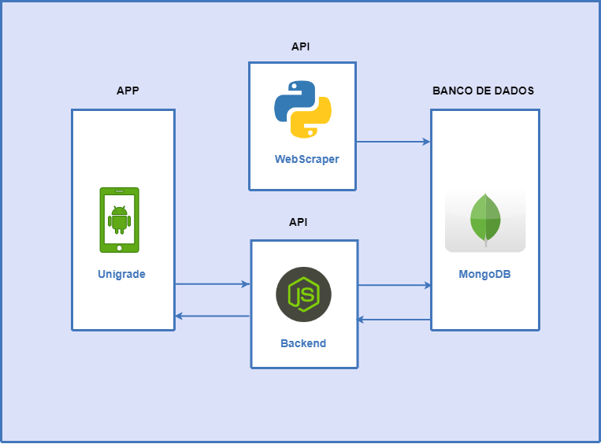

# Arquitetura

## Histórico de revisões
|   Data   |  Versão  |        Descrição       |          Autor(es)          |
|:--------:|:--------:|:----------------------:|:---------------------------:|
|23/03/2019|   0.1    | Iniciando o documento       |   Guilherme Aguiar  |
|24/03/2019|   0.2    | Adição do tópicos sumário e API |   Gabriel Carvalho  |
|24/03/2019|   0.3    | Correção de sumário e adição de visão geral |   Geovana Ramos  |

-------------------------

## Sumário
[1. Visão Geral](#1-visao)  
[2. App](#2-app)  
[3. API](#3-api)  
[4. Banco de Dados](#4-banco) 
[5. Referências](#5-referencias) 

## 1. Visão Geral

O sistema será composto pelo aplicativo Android, duas APIs e um banco de dados. O app irá fazer requisições à API Node para recuperar as disciplinas e montar as grades, a qual irá recuperar dados do banco. A API WebScraper irá varrer o matrícula web e salvar os dados no banco de dados MongoDB.

## 2. App
#### 2.1 Tecnologias

## 3. API
A API será desenvolvida utilizando os princípios REST (Representational State Transfer), que se comunica por meio do protocolo HTTP (Hypertext Transfer Protocol), onde é possível enviar e receber dados utilizando os métodos GET, POST, PUT e DELETE.

### 3.1 Tecnologias

Para o desenvolvimento da nossa API, iremos utilizar Node.js e o framework Express.js. Node foi escolhido por ser possível trabalhar com requisições assíncronas, fazendo com que a API ganhe mais performance. Express.js foi escolhido por facilitar o desenvolvimento da API utilizando Node.js.

## 4. Banco de Dados
### 4.1 Tecnologias

### 5. Referências
Reunião feita na aula do dia 22/03/2019. 
[Mapa Mental feito na aula](dinamica01/mapamental.md) 
