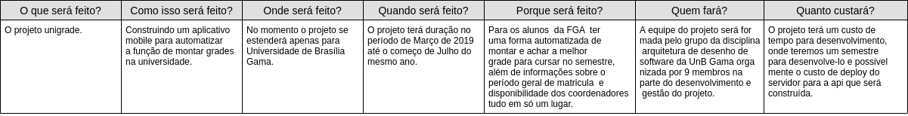

# 5w2h

## Histórico de revisões
|   Data   |  Versão  |        Descrição       |          Autor(es)          |
|:--------:|:--------:|:----------------------:|:---------------------------:|
|23/03/2019|   0.1    | Iniciando o documento       |   Guilherme Aguiar  |
|24/03/2019|   0.2   | Adição dos tópico Sumário, Introdução e Referências      |   Daniel Maike  |
|24/03/2019|   0.3    |  Adição do 5W2H       |   Daniel Maike  |

## Sumário
[1. Introdução](#1.-introdução)  
[2. 5W2H](#2.-5W2H)  
[3. Referencias](#3.-referências)

## 1. Introdução

 A ferramenta de gestão 5W2H parte de uma meta para organizar as ações e determinar o que será feito para ser alcançada, por qual razão, por quem, como, quando e onde será feito e estimar o quanto isso custará. A metodologia costuma ser utilizada em projetos para avaliar, acompanhar e garantir que as atividades sejam executadas com clareza e excelência por todos os envolvidos a partir de sete perguntas: o que (what), por que (why), onde (where), quando (when), quem (who), como (how) e quanto custa (how much).

## 2. 5W2H

### 2.1

### 2.2 

## 3. Referências

https://gitlab.com/atlasds/ds2017  
Slide 12 e 13 da aula 02 da disciplina de Arquitetura e Desenho de Software da UnB-Gama - Professora: Milene Serrano  
ROCHA, Hugo. 5W2H: o que significa, para que serve, como fazer e exemplos. Disponível em https://klickpages.com.br/blog/5w2h-o-que-significa/  