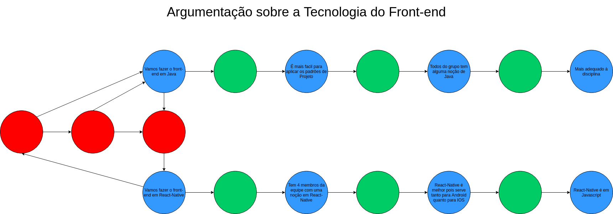

# Argumentação

## Histórico de revisões
|   Data   |  Versão  |        Descrição       |          Autor(es)          |
|:--------:|:--------:|:----------------------:|:---------------------------:|
|24/03/2019|   0.1    | Iniciando o documento       |   Guilherme Deusdará  |
|24/03/2019|   0.2    | Adicionando Argumentação de Front-End       |   Guilherme Deusdará  |
|24/03/2019|   0.3    | Arrumando Links       |   Guilherme Deusdará  |

## Sumário
[1. Introdução](#1-introdução)  
[2. Argumentações](#2-argumentações)  
[3. Referencias](#3-referências)

## 1. Introdução 

Segundo Rahwan (2005) [ [1] ](#3.-referências), a argumentação pode ser vista como uma interação social
baseada em princípios. Ela é composta de argumentos incompatíveis e almeja chegar a
uma conclusão consistente e racional. Uma das principais metas da argumentação é a
resolução de pontos de vistas controversos. Estes pontos de vistas devem ser justificáveis
ou refutáveis dependendo da informação disponibilizada. Isto distingue a argumentação
do raciocínio dedutivo clássico, em que o acréscimo de novas premissas não influencia uma
prova previamente definida.

## 2. Argumentações

### 2.1 Escolha das Tecnologias

## 3. Referências

[1] RAHWAN, I. et al. Representing and classifying arguments on the semantic web. The  
Knowledge Engineering Review, v. 26, p. 487–511, 12 2011. ISSN 1469-8005. Disponível  
em: <http://journals.cambridge.org/article_S0269888911000191>. Citado na página 36.    

