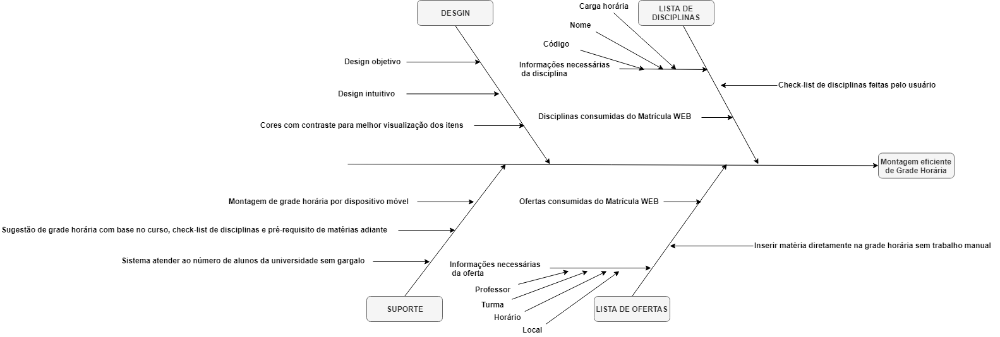

# Diagrama Causa-Efeito

# 5w2h

## Histórico de revisões
|   Data   |  Versão  |        Descrição       |          Autor(es)          |
|:--------:|:--------:|:----------------------:|:---------------------------:|
|23/03/2019|   0.1    | Iniciando o documento       |   Guilherme Aguiar  |
|24/03/2019|   0.2   | Adição dos tópico Sumário, Introdução e Referências      |   Daniel Maike  |
|24/03/2019|   0.3    |  Adição do Causa-Efeito       |   Daniel Maike  |

## Sumário
[1. Introdução](#1.-introdução)  
[2. Causa-Efeito](#2.-causa-efeito)  
[3. Referencias](#3.-referências)

## 1. Introdução

O diagrama de causa e efeito é utilizado para a análise de dispersões no processo, visando fazer as pessoas pensarem sobre causa e razões possíveis que fazem com que um problema ocorra.

## 2. Causa-Efeito

### 2.1 Montagem eficiente de grade horária

## 3. Referências

https://gitlab.com/atlasds/ds2017  
Slides 18, 19 e 20 da aula 02 da disciplina de Arquitetura e Desenho de Software da UnB-Gama - Professora: Milene Serrano  