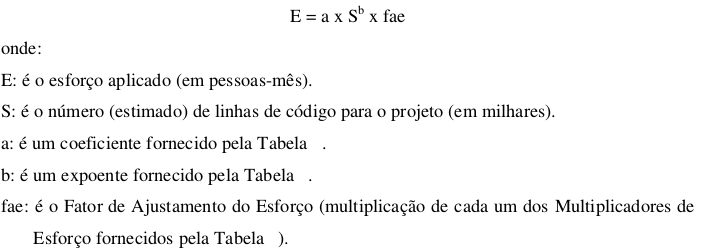

# Modelo de Custo Produtivo (COnstructive COst MOdel - COCOMO)

## Histórico de revisões
|   Data   |  Versão  |        Descrição       |          Autor(es)          |
|:--------:|:--------:|:----------------------:|:---------------------------:|
|24/03/2019|   0.1    | Iniciando e elaborando       |   Guilherme Aguiar  |

## Sumário
[1. Introdução](#1.-introdução)  
[2. Modelo de Custo Produtivo Intermediário](#2.-Modelo)  
[3. Resultados](#3.-resultados)  
[4. Referencias](#4.-referências)

## 1. Introdução
O 'método COCOMO' (ou COnstructive COst MOdel) é um modelo de estimativa do tempo e esforço de desenvolvimento de um software.

COCOMO consiste em três implementações: 

- **COCOMO Básico (Basic):** computa o esforço e o custo de desenvolvimento considerando
uma estimativa do tamanho do programa.
- **COCOMO Intermediário (Intermediate):** computa o esforço e o custo de
desenvolvimento considerando uma estimativa do tamanho do programa e um conjunto de
direcionadores de custo (avaliações subjetivas do produto, do hardware, do pessoal e dos
atributos do projeto).
- **COCOMO Detalhado (Detailed):** além das características do COCOMO intermediário,
inclui uma avaliação do impacto dos direcionadores de custo sobre cada etapa do
desenvolvimento.

## 2. Modelo de Custo Produtivo Intermediário

Este modelo amplia o modelo básico com a finalidadade de levar em consideração um
conjunto de atributos direcionadores do custo que são agrupados em quatro categorias:

### **Atributos do produto**
- confiabilidade exigida do software;
- tamanho do banco de dados;
- complexidade do produto.
### **Atributos do hardware:**
- restrições ao tempo de execução;
- restrições de memória;
- volatilidade do ambiente de máquina virtual;
- tempo de turnaround (tempo para completar o ciclo) exigido.
### **Atributos de pessoal:**
- capacidade do analista;
- experiência em aplicações;
- capacidade do programador;
- experiência em máquina virtual;
- experiência com a linguagem de programação.
### **Atributos de projeto:**
- uso de práticas modernas de programação;
- uso de ferramentas de software;
- cronograma exigido de desenvolvimento.

Cada um desses atributos deve ser classificado de acordo com uma escala que varia de “muito
baixo” a “extremamente elevado” (em importância e valor). Esta escala é apresentada na
tabela abaixo: 

#### Cálculo da estimativa de esforço (PESSOAS/MÊS)

Finalmente, para  calcular a estimativa do esforço, utilizamos a seguinte equação:

Para Boehm (1981) os valores do coeficiente “a” e do expoente “b” do modelo COCOMO
Intermediário são apresentados na tabela abaixo:

Onde: 

- **Modo Orgânico:** projetos simples, relativamente pequenos, com conjuntos de requisitos
não tão rígidos, com equipes pequenas e experientes.

- **Modo Semidestacado:** projetos intermediários (em tamanho e complexidade), com alguns
requisitos rígidos e outros não tão rígidos, com níveis mistos de experiência nas equipes.

- **Modo Embutido:** projetos com conjunto rígido de restrições operacionais, tanto de
hardware, quanto de software.

#### Cálculo da estimativa de tempo (MÊS)

O cálculo para estimativa de tempo utiliza a seguinte equação:

## 3. Resultados
### Estimativa de tamanho

Levando em conta a versão anterior do UniGrade feita na disciplina de Desenvolvimento de Software por alguns integrantes deste grupo, que contou com cerca de **5268 linhas de código**, também o provável amadurecimento das habilidades de gerênciamento e desenvolvimento de software da equipe e a adoção de novas técnologias que visam facilitar o desenvolvimento, nossa estimativa inicial do número de linhas de código é de no mínino **4000 linhas de código**. 

## - S = 4000 LoC ou S = 4 KLoC
###### LoC = Linhas de código

### Estimativa de esforço

Substituindo os valores na equação de esforço temos que:

## - E = a * S^b * fae
## - E = 3 * 4^1,12 * 0,89
## - E = 11,76 pessoas/mês

O peso dado aos direcionadores de custo foi o seguinte:

### Estimativa de tempo

## - T = c * E^d
## - T = 2,5 * 11,76 ^0,35
## - T = 5,92 meses 

## 4. Referências

Meller, Maristela Corrêa. Modelos Para Estimar Custos De Software: Estudo Comparativo Com Softwares De Pequeno Porte. 2002. 