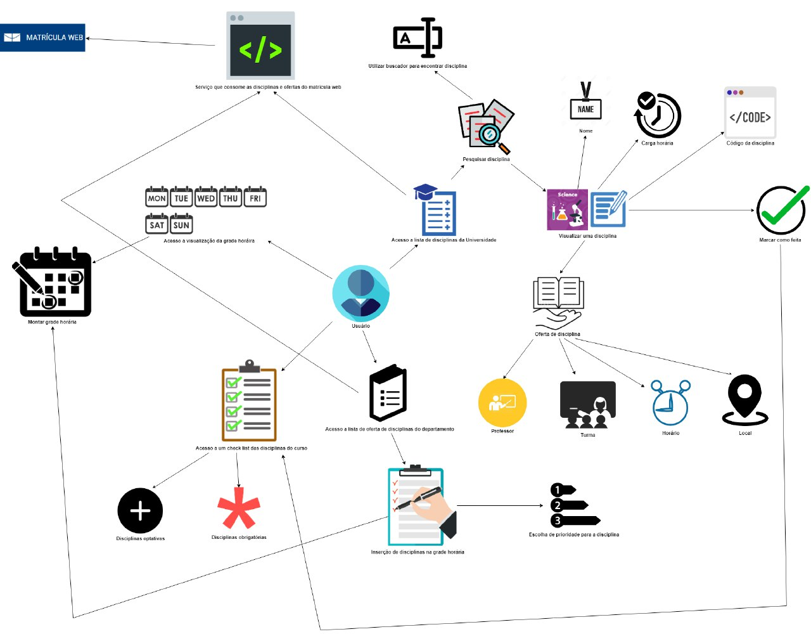

# Rich Picture

## Histórico de revisões
|   Data   |  Versão  |        Descrição       |          Autor(es)          |
|:--------:|:--------:|:----------------------:|:---------------------------:|
|23/03/2019|   0.1    | Iniciando o documento       |   Guilherme Aguiar  |
|24/03/2019|   0.2   | Adição dos tópico Sumário, Introdução e Referências      |   Daniel Maike  |
|24/03/2019|   0.3    |  Adição do RichPicture de usuário       |   Daniel Maike  |

## Sumário
[1. Introdução](#1.-introdução)  
[2. RichPictures](#2.-richpictures)  
[3. Referencias](#3.-referências)

## 1. Introdução

O Rich Picture é uma técnica de requisitos de software, elaborada na fase de pré-rastreabilidade. São desenho feitos a mão ou digitalmente a fim de expressar ideias, que representam um subsistema de um sistema maior. É um artefato considerado informal e muito útil na identificação das partes envolvidas, a fim abrir espaço para discussões e ser uma forma de compreender o problema amplamente.

## 2. RichPictures

### Usuário

#### Versão 1.0

#### Versão 2.0

#### Versão 3.0

### Aplicativo e usuário

#### Versão 1.0

## 3. Referências

Slide 10 da aula 04 da disciplina de Requisitos de Software da UnB-Gama - Professores: Milene Serrano e Maurício Serrano  
Slides 15, 16 e 17 da aula 02 da disciplina de Arquitetura e Desenho de Software da UnB-Gama - Professora: Milene Serrano  
https://rockcontent.com/blog/web-crawler/  
https://gitlab.com/atlasds/ds2017