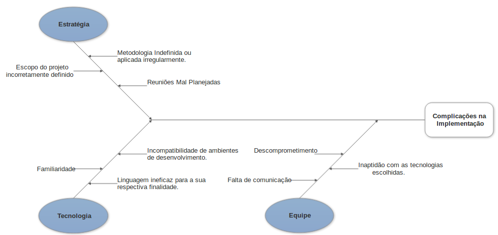

# Diagrama Causa-Efeito

## Histórico de revisões
|   Data   |  Versão  |        Descrição       |          Autor(es)          |
|:--------:|:--------:|:----------------------:|:---------------------------:|
|23/03/2019|   0.1    | Iniciando o documento       |   Guilherme Aguiar  |
|24/03/2019|   0.2   | Adição dos tópicos Sumário, Introdução e Referências      |   Daniel Maike  |
|24/03/2019|   0.3    |  Adição do Causa-Efeito 2.1      |   Daniel Maike  |
|24/03/2019|   0.3    |  Adição do Causa-Efeito 2.2      |   Joberth Rogers  |
|24/03/2019|   0.4    |  Adição do Causa-Efeito 2.3       |   Guilherme Aguiar  |
|26/03/2019|   0.5    |  Arrumando links      |   Daniel Maike |
| 26/04/2019 | 0.6 | Adicionando zoom nas imagens ao clicar | Joberth Rogers |

## Sumário
[1. Introdução](#1-introducao)  
[2. Causa-Efeito](#2-causa-efeito)  
[3. Referências](#3-referencias)

## 1. Introdução

O diagrama de causa e efeito é utilizado para a análise de dispersões no processo, visando fazer as pessoas pensarem sobre causa e razões possíveis que fazem com que um problema ocorra. [ [2] ](#referencias)

## 2. Causa-Efeito

### 2.1 Montagem eficiente de grade horária

### 2.2 Dificuldades e empecilhos dos alunos no período de matrícula

### 2.3 Complicações na implementação do projeto

## 3. Referências

[1] https://gitlab.com/atlasds/ds2017  
[2] Slides 18, 19 e 20 da aula 02 da disciplina de Arquitetura e Desenho de Software da UnB-Gama - Professora: Milene Serrano  
