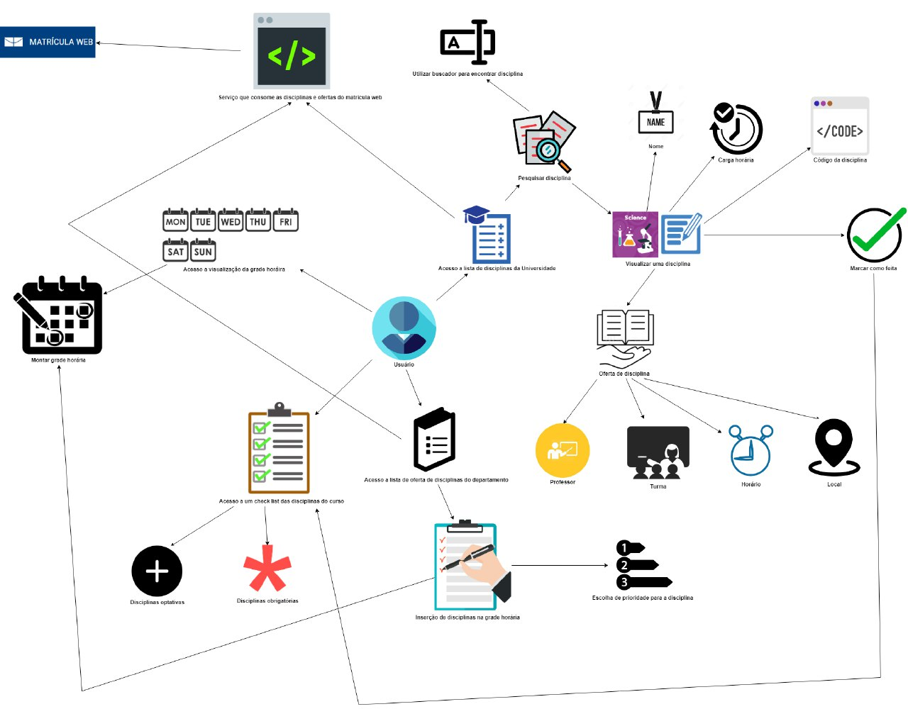
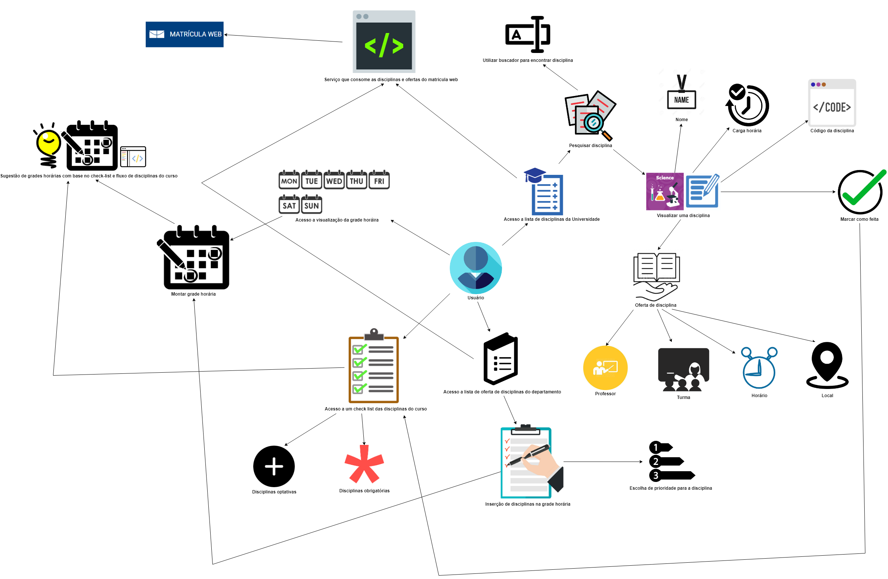
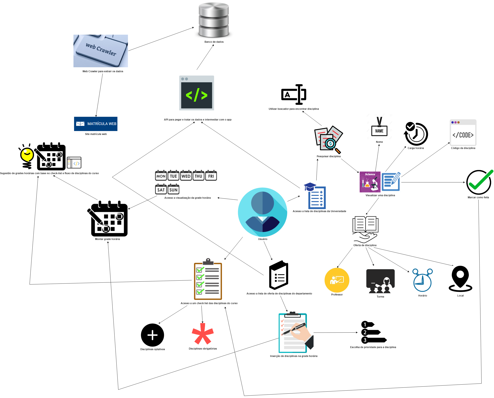
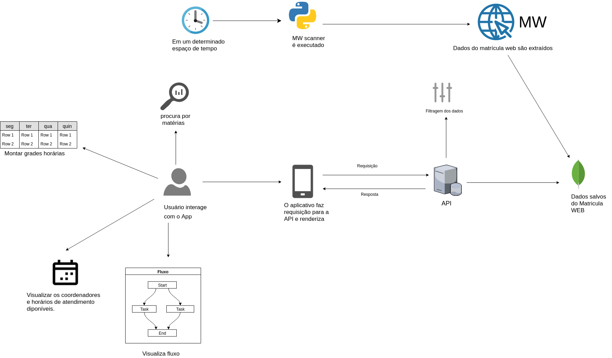
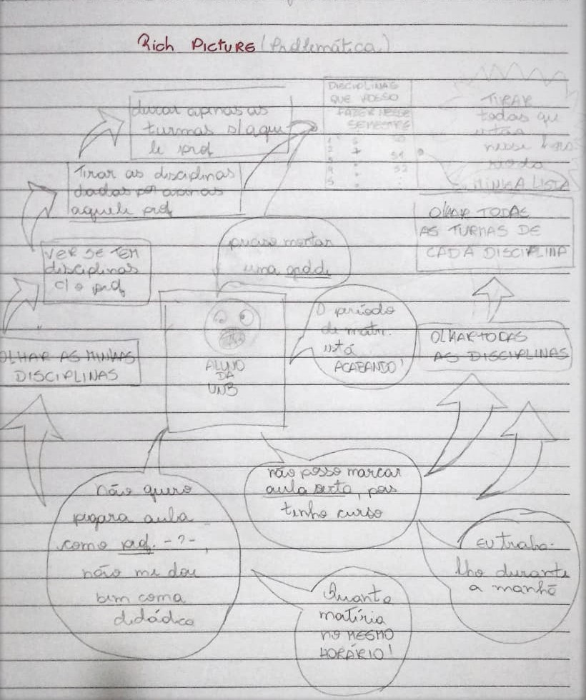
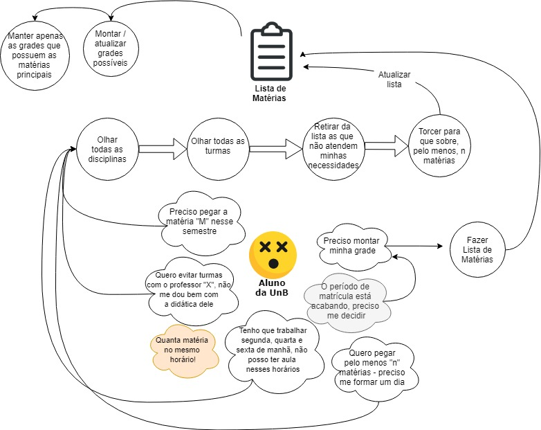
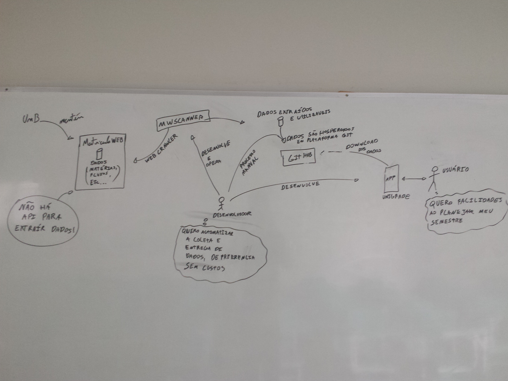
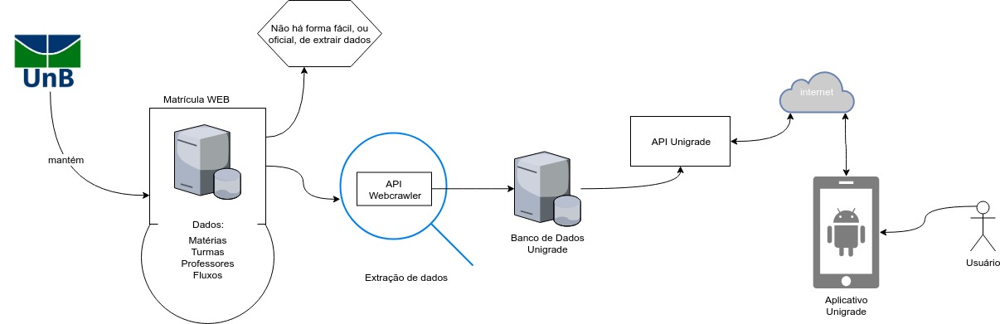

# Rich Picture

## Histórico de revisões
|   Data   |  Versão  |        Descrição       |          Autor(es)          |
|:--------:|:--------:|:----------------------:|:---------------------------:|
|23/03/2019|   0.1    | Iniciando o documento       |   Guilherme Aguiar  |
|24/03/2019|   0.2   | Adição dos tópico Sumário, Introdução e Referências      |   Daniel Maike  |
|24/03/2019|   0.3    |  Adição do RichPicture de usuário       |   Daniel Maike  |
|24/03/2019|   0.4    |  Adição do RichPicture do aplicativo e usuário       |   joberth Rogers  |
|24/03/2019|   0.5    |  Adição do RichPicture do fluxo de dados       |   Guilherme Guy  |
|24/03/2019|   0.6    |  Adição do RichPicture da problemática       |   Gabriela Medeiros  |
|26/03/2019|   0.7    |  Arrumando links      |   Daniel Maike |

## Sumário
[1. Introdução](#1-introdução)  
[2. RichPictures](#2-richpictures)  
[3. Referências](#3-referências)

## 1. Introdução

O Rich Picture é uma técnica de requisitos de software, elaborada na fase de pré-rastreabilidade. São desenho feitos a mão ou digitalmente a fim de expressar ideias, que representam um subsistema de um sistema maior. É um artefato considerado informal e muito útil na identificação das partes envolvidas, a fim abrir espaço para discussões e ser uma forma de compreender o problema amplamente. [ [1] ](#referências) [ [2] ](#referências)

## 2. RichPictures

### Usuário

Rich Picture com foco no usuário e nas ações que ele pode realizar no sistema.

#### Versão 1.0

#### Versão 2.0

#### Versão 3.0

### Aplicativo e usuário

Rich picture que descreve como o aplicativo processa os dados e disponibilza ao usuário. 

#### Versão 1.0

### Problemática

#### Versão 1.0

#### Versão 2.0

### Fluxo de Dados

#### Fluxo Legado

Como o projeto Unigrade é baseado em um sistema já criado, existe um fluxo já implementado para os dados que a aplicação necessita. Este rich picture tenta demonstrar o fluxo atual e alguns de seus pontos fracos.

#### Novo Fluxo
##### Versão 1.0

Este Rich Picture tenta representar a nova proposta de fluxo de dados para o sistema.

## 3. Referências

[1] Slide 10 da aula 04 da disciplina de Requisitos de Software da UnB-Gama - Professores: Milene Serrano e Maurício Serrano  
[2] Slides 15, 16 e 17 da aula 02 da disciplina de Arquitetura e Desenho de Software da UnB-Gama - Professora: Milene Serrano  
[3] https://rockcontent.com/blog/web-crawler/  
[4] https://gitlab.com/atlasds/ds2017  
[5] Audios Reunião dia 18/03/2018, presente no link: https://drive.google.com/drive/folders/1krGcJWnMwMN8nvdFoCcBlZBWBollCCqw
