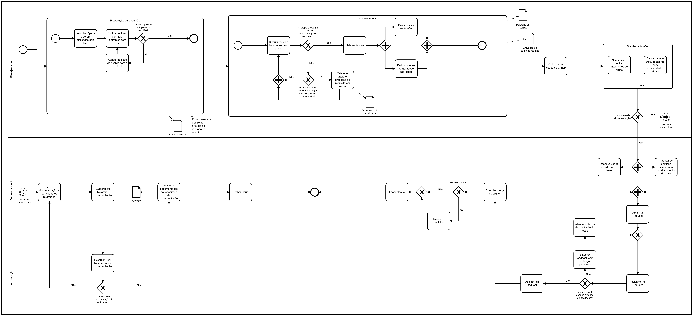
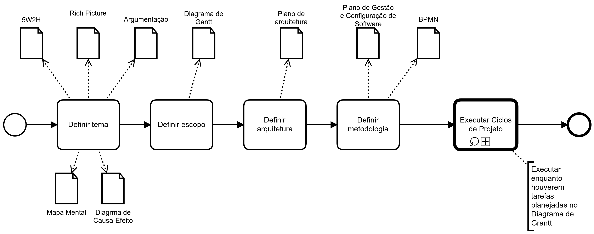

# Desenho da Metodologia

## Histórico de revisões

|   Data   |  Versão  |        Descrição       |          Autor(es)          |
|:--------:|:--------:|:----------------------:|:---------------------------:|
|04/04/2019|   0.1    | Criação do documento       |   Daniel Maike  |
|04/04/2019|   0.2   | Adição dos tópicos Sumário, Introdução e Referências      |   Daniel Maike, Guilherme Guy  |
|04/04/2019|   0.3   | Adição dos Business Process Model and Notation      |   Daniel Maike, Guilherme Guy  |

## Sumário
[1. Introdução](#1-introducao)  
[2. Business Process Model and Notation](#2-business-process-model-and-notation)  
[3. Referências](#3-referencias)

## 1. Introdução

## 2. Business Process Model and Notation

### 2.1 Desenvolvimento

### 2.2 Geral

## 3. Referências
