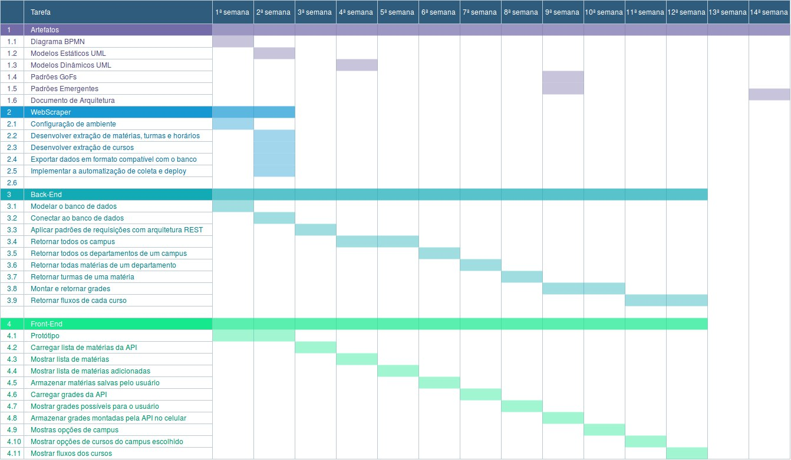
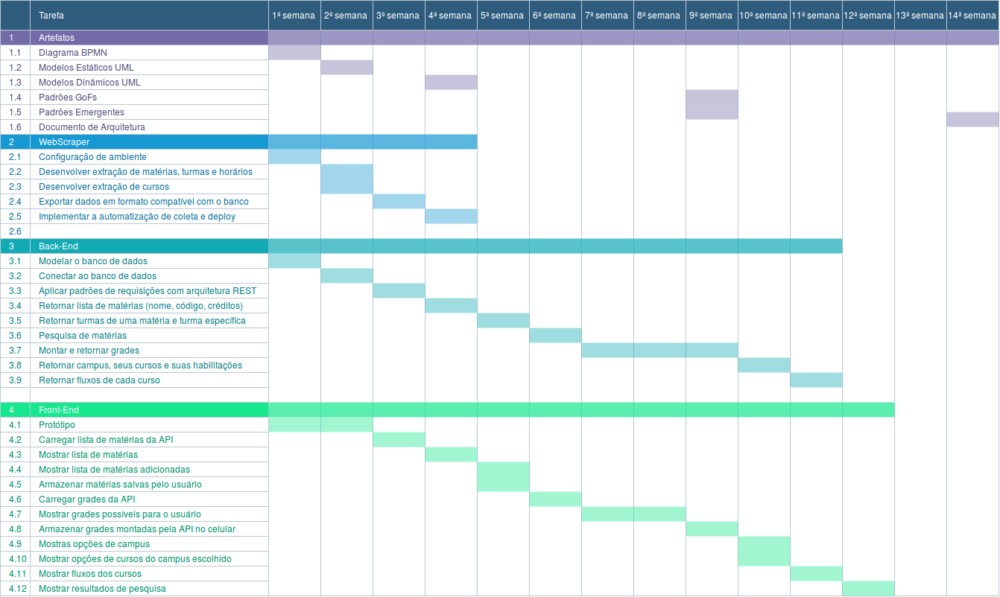
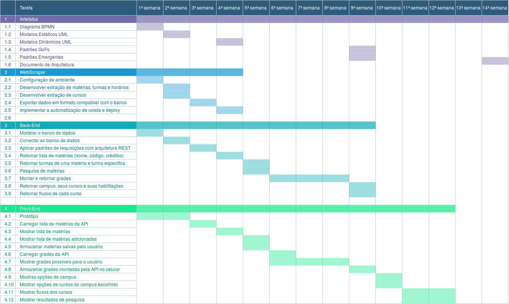
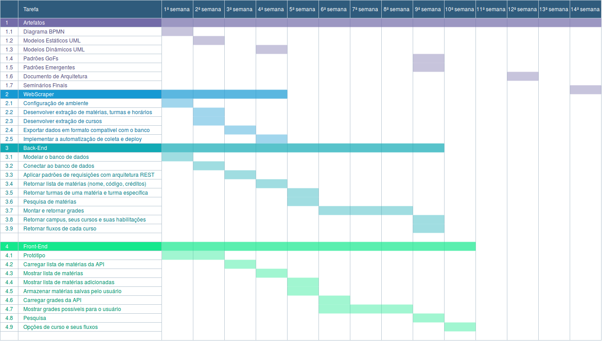

# Diagrama de Gantt

## Histórico de revisões
|   Data   |  Versão  |        Descrição       |          Autor(es)          |
|:--------:|:--------:|:----------------------:|:---------------------------:|
|04/04/2019|   0.1    | Iniciando o documento       |   Joberth Rogers  |
|23/04/2019|   0.2    | Adicionando versão 2.0 do diagrama       |   Geovana Ramos  |
| 26/04/2019 | 0.3 | Adicionando zoom nas imagens ao clicar | Joberth Rogers |
| 29/04/2019 | 0.4 | Adicionando versão 3.0 do diagrama | Geovana Ramos |
| 31/05/2019 | 0.5 | Adicionando versão 5.0 do diagrama e descrições das versões | Geovana Ramos |

## Sumário
[1. Introdução](#1-introducao)  
[2. Diagrama ](#2-diagrama) 
[3. Referências ](#3-referencias)

## 1. Introdução

Esse diagrama é uma ferramenta visual no qual é usada para controlar o conograma e estipular os prazos de entrega validado previamente de um determinado projeto. Seu principal objetivo é verificar interdepêndencias entre atividades, mostrar as tarefas do projeto que precisam ser realizadas de uma forma geral no decorrer do tempo de desenvolvimento, distribuir todas as responsabilidades entre o grupo e definir prazos. Dessa forma é possível visualizar o andamento do projeto de forma geral e manter a equipe focada naquilo que deve ser feito. 

## 2. Diagrama

#### versão 1.0
Versão inicial discutida pelo grupo.

#### versão 2.0
WebScraper - O tempo definido anteriormente não seria sufiente para terminar todo o script.

API - O grupo percebeu que as tarefas não estavam bem definidas em texto, por isso houve uma refatoração na descrição das tarefas. Além disso, foi possível perceber que algumas tarefas poderiam ser feitas mais rapidamente, dando tempo a mais para tarefas mais difícies.

App - Foi observado que algumas tarefas precisariam de mais tempo, e por isso tarefas mais simples serão feitas em uma semana ao mesmo tempo.

#### versão 3.0

API - Equipe da API percebeu que poderia fazer mais uma tarefa na semana.

App - Aumento de tempo nas duas últimas tarefas.

#### versão 4.0

App - Fusão de algumas tarefas em uma só. Adiantamento do cronograma para que sobrasse mais tempo para se dedicar à documentação.

## 3. Referências

[1] https://www.projectbuilder.com.br/blog/grafico-de-gantt-como-e-por-que-utiliza-lo-para-gerenciar-projetos/