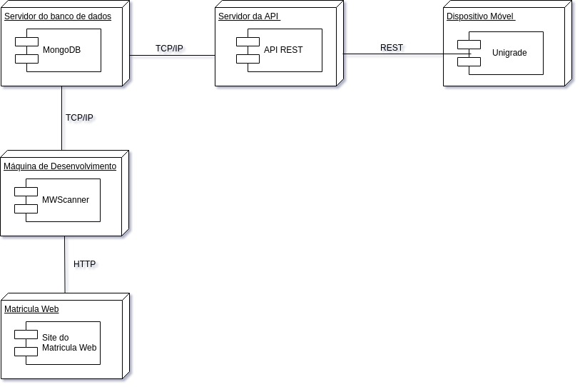
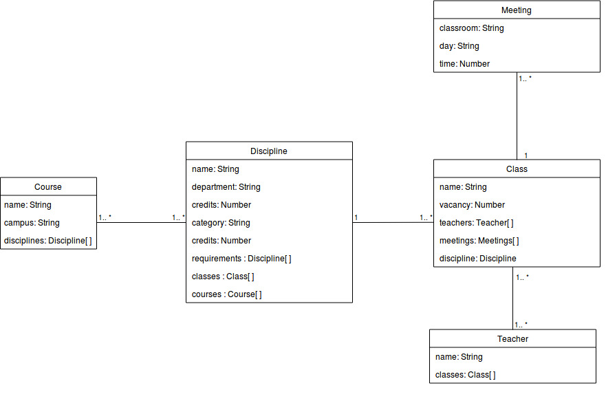
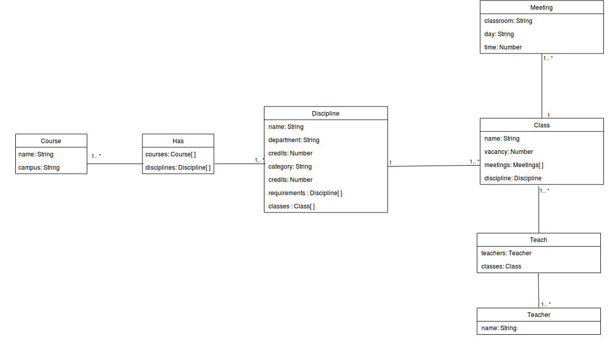

# Diagramas API e Banco de dados

## Histórico de revisões

|   Data   |  Versão  |        Descrição       |          Autor(es)          |
|:--------:|:--------:|:----------------------:|:---------------------------:|
|14/04/2019|   0.1    | Criação do documento       |   Gabriel Carvalho  |
|14/04/2019|   0.2    | Adicionados Introdução e Diagrama de Implementação     |   Gabriel Carvalho  |
|14/04/2019|   0.3    | Adicionado UML do banco de dados  |   Ezequiel de oliveira  |
|14/04/2019|   0.4    | Adicionado UML do banco de dados segunda versao |   Ezequiel de oliveira  |
|15/04/2019|   0.5    | Correção nos tópicos e súmario |   Gabriel Carvalho  |
| 26/04/2019 | 0.6 | Adicionando zoom nas imagens ao clicar | Joberth Rogers |
| 30/06/2019 | 0.7 | Adicionando diagrama de classes da aplicação | Guilherme Guy |

## Sumário

[1. Introdução](#1-introducao)  
[2. Diagrama de Implementação](#2-diagrama-de-implementacao)  
[3. Diagrama de Banco de Dados](#3-diagrama-de-classe)  
[4. Diagrama de Classes](#4-diagrama-de-classes)
[5. Referências](#5-referencias)

## 1. Introdução
O diagrama de implementação é usado para modelar a arquitetura física de um sistema. Mostram os relacionamentos entre os componentes de software e hardware no sistema, a organização física dos nós em um sistema distribuído, os artefatos que estão armazenados em cada nó e os componentes e outros elementos que os artefatos implementam. Os nós representam dispositivos de hardware como por exemplo servidores, sensores e impressoras, bem como outros dispositivos que suportam o ambiente de tempo de execução de um sistema. Caminhos de comunicação e relacionamentos de implementação modelam as conexões do sistema.

## 2. Diagrama de Implementação
### Versão 1.0

## 3. Diagrama de Banco de Dados
Por questões didáticas, o banco de dados não relacional obteve uma diagramação buscando maior proximidade a um banco relacional, para melhor entendimento
### Não-Relacional
#### Versão 1.0

### Relacional
#### Versão 1.0

## 4. Diagrama de Classes
### Versão 1.0

## 5. Referências
* <https://www.ibm.com/support/knowledgecenter/pt-br/SS4JE2_7.5.5/com.ibm.xtools.modeler.doc/topics/cdepd.html>  