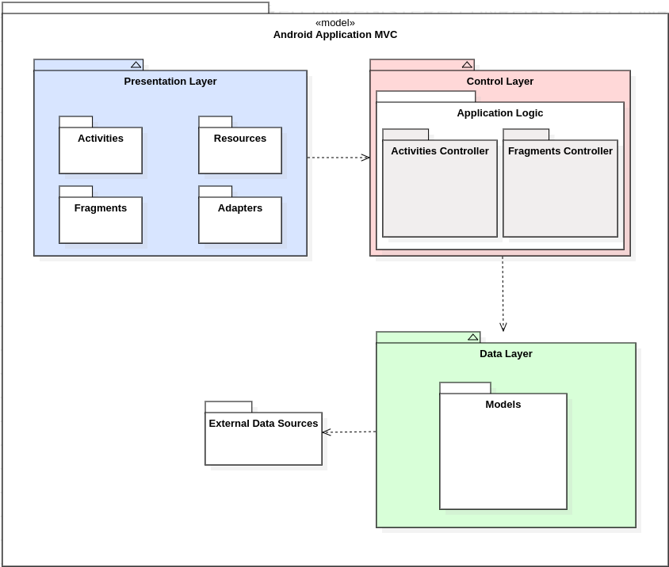

# Diagramas App

## Histórico de revisões

|   Data   |  Versão  |        Descrição       |          Autor(es)          |
|:--------:|:--------:|:----------------------:|:---------------------------:|
|13/04/2019|   0.1    | Criação do documento       |   Guilherme Aguiar  |
|14/04/2019|   0.2    | Elaboração do documento       |   Guilherme Aguiar  |

## Sumário

[1. Introdução](#1-introducao)  
[2. Diagrama de pacotes: MVC](#2-diagrama-de-pacotes-mvc)  
[3. Referências](#3-referencias)

## 1. Introdução
O diagrama de pacotes mostra o arranjo e a organização dos elementos do modelo em projetos de médio a grande porte que podem ser usados para mostrar a estrutura e as dependências entre subsistemas ou módulos, como por exemplo: classes, interfaces e até mesmo outros pacotes de acordo com a semântica. Eles são bastante utilizados para representar a arquitetura do projeto. 
No contexto do projeto Unigrade, utilizaremos um diagrama de pacotes para descrever o modelo MVC no que diz respeito ao aplicativo.

## 2. Diagrama de pacotes: MVC
###Versão 1.0

## 3. Referências
* <https://online.visual-paradigm.com/tutorials/package-diagram-tutorial/>  
* <https://www.visual-paradigm.com/guide/uml-unified-modeling-language/what-is-package-diagram/>  
* <https://pt.stackoverflow.com/questions/168069/como-representar-as-classes-do-mvc-na-uml>