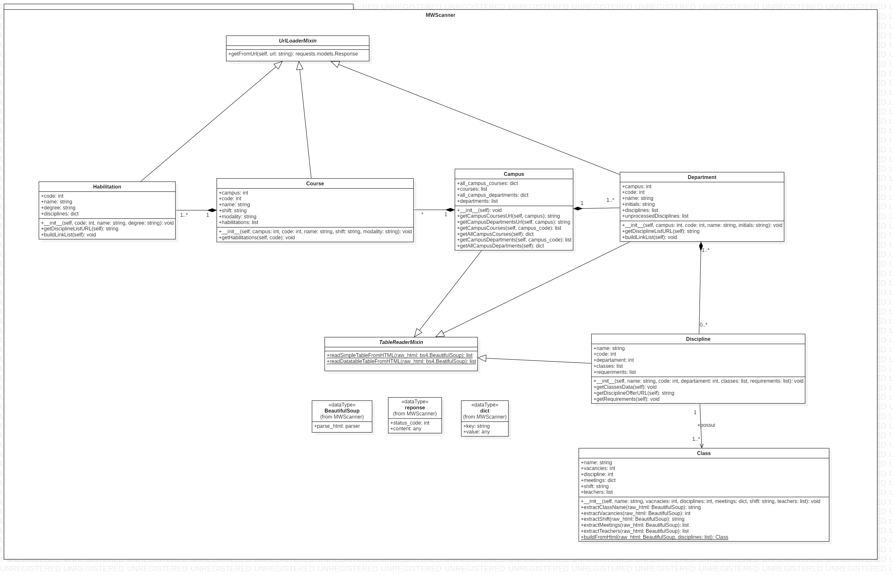
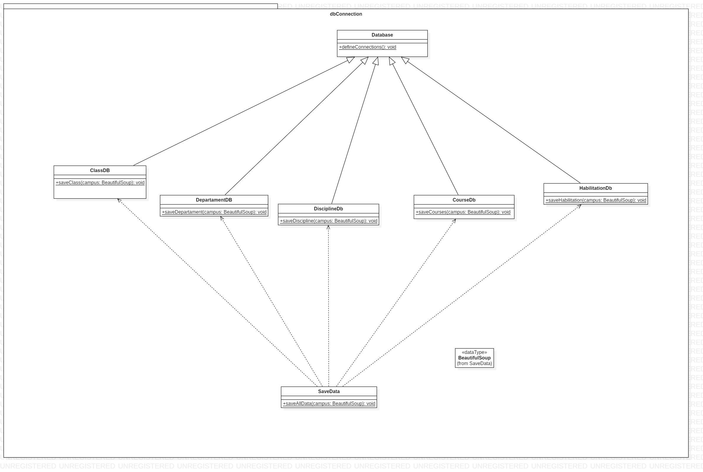
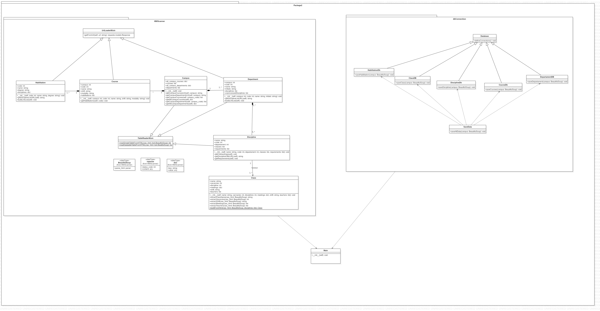

# Diagramas WebScrapper

## Histórico de revisões

|   Data   |  Versão  |        Descrição       |          Autor(es)          |
|:--------:|:--------:|:----------------------:|:---------------------------:|
|15/04/2019|   0.1    | Criação do documento       |   Daniel Maike  |
|15/04/2019|   0.2    | Adição do tópico de introdução e referências       |   Daniel Maike  |
|15/04/2019|   0.3    | Adição do diagrama de classes do MWScanner     |   Daniel Maike  |
|15/04/2019|   0.4    | Adição do diagrama de classes da conexão com o banco de dados     |   Joberth Rogers |
|15/04/2019|   0.5    | Adição do diagrama geral do WebScrapper     |  Daniel Maike e Joberth Rogers |

## Sumário

[1. Introdução](#1-introducao)  
[2. Diagramas UML](#2-diagramas-uml)  
[3. Referências](#3-referencias)

## 1. Introdução

Em programação, um diagrama de classes é uma representação da estrutura e relações das classes que servem de modelo para objetos. Podemos afirmar de maneira mais simples que seria um conjunto de objetos com as mesmas características, assim saberemos identificar objetos e agrupá-los, de forma a encontrar suas respectivas classes. Na Unified Modeling Language (UML) em diagrama de classe, uma classe é representada por um retângulo com três divisões, são elas: O nome da classe, seus atributos e por fim os métodos.
Com o diagrama de classes foram representadas as classes do WebScrapper que é composto dos pacotes MWScanner e o de conexão com o banco de dados com os dados extraídos pelo MWScanner.

## 2. Diagramas UML

### Diagrama de classes MWScanner

O diagrama representa as classes do MWScanner, responsável por extrair os dados do Matrícula Web de Campus, Departamentos, Disciplinas, Ofertas das Disciplinas, Cursos e Habilitações.

### Diagrama de classes da conexão com o banco

O diagrama representa as classes da conexão com o banco de dados, responsável por tratar e preparar os dados extraídos pelo MWScanner para serem enviados ao banco de dados.

### Diagrama geral do WebScrapper

O diagrama representa o funcionamento geral do WebScrapper. A main executa o WebScrapper.

## 3. Referências

* <https://online.visual-paradigm.com/tutorials/package-diagram-tutorial/>  
* <https://www.devmedia.com.br/orientacoes-basicas-na-elaboracao-de-um-diagrama-de-classes/37224>  
* <https://www.visual-paradigm.com/guide/uml-unified-modeling-language/what-is-package-diagram/>  