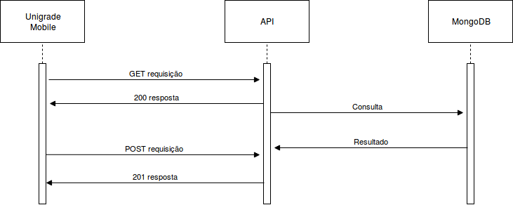
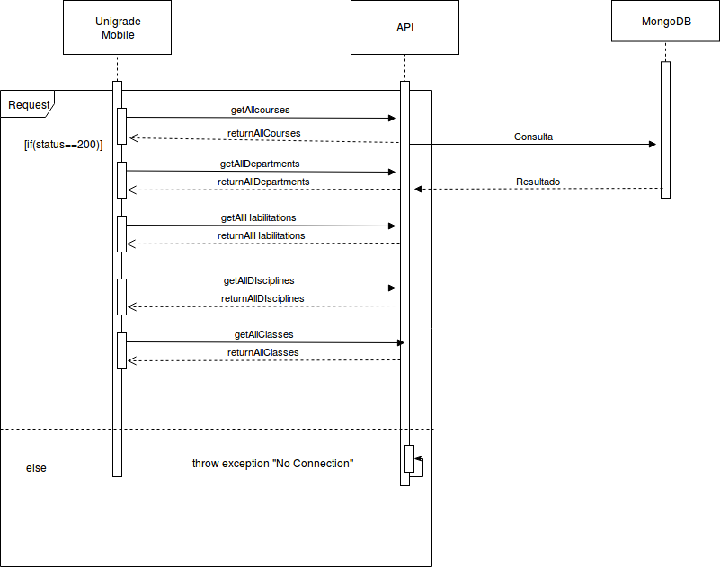
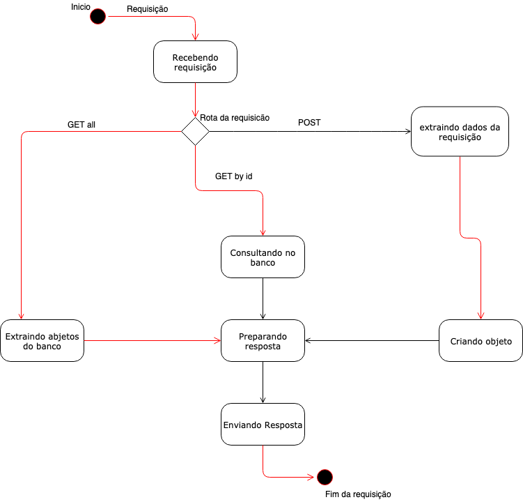
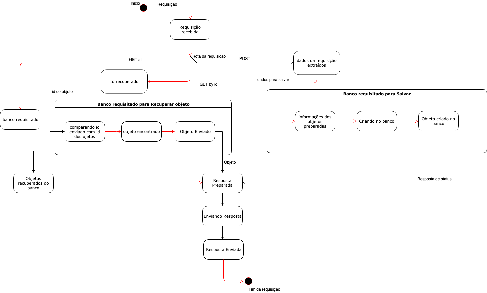

# Modelos Dinâmicos: API e Banco de Dados

## Histórico de revisões
|   Data   |  Versão  |        Descrição       |          Autor(es)          |
|:--------:|:--------:|:----------------------:|:---------------------------:|
|28/04/2019|    0.1   | Adicionado diagrama de colaboração   | Gabriel Carvalho |
|28/04/2019|    0.2   | Adicionado diagrama de Sequencia   | Ezequiel De Oliveira |
|28/04/2019|    0.3   | Adicionado diagrama de Estado   | Guilherme Deusdará |

## Sumário
[1. Diagrama de Sequência](#1-diagramas-de-sequencia)  
[2. Diagrama de Estado](#2-diagrama-de-estados)  
[3. Diagrama de Colaboração](#3-diagrama-de-colaboração)  

## 1. Diagramas de Sequência
### Fluxo Geral do APP

### Versão 1.0

### Versão 2.0

## 2. Diagrama de Estados

### Versão 1.0

### Versão 2.0

## 3. Diagrama de Colaboração

O Diagrama de Colaboração exibe uma interação, consistindo de um conjunto de objetos e seus relacionamentos, incluindo as mensagens que podem ser trocadas entre eles.

## Fluxo de Requisição das Matérias

### Versão 1.0

