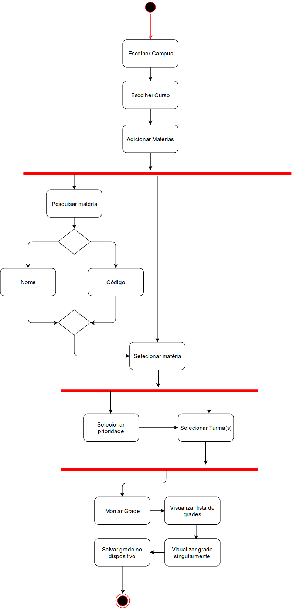
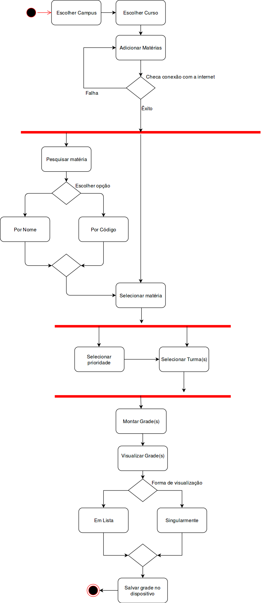

# Modelos Dinâmicos: App

## Histórico de revisões
|   Data   |  Versão  |        Descrição       |          Autor(es)          |
|:--------:|:--------:|:----------------------:|:---------------------------:|
|28/04/2019|0.1|   Adicionado diagramas de sequência  |  Gabriela Medeiros  |
|28/04/2019|0.2|   Corrigindo sumário/links e adicionando diagrama de estado  |  Geovana Ramos  |
|28/04/2019|0.3|   Adicionado diagrama 2 de Colaboração  |  Rafael Braganca  |
|28/04/2019|0.4|   Adicionando diagrama de atividade  |  Guilherme Aguiar  |
|30/04/2019|0.5|   Corrigindo erro no layout do documento  |  Guilherme Guy  |

## Sumário
[1. Diagramas de Sequência](#1-diagramas-de-sequencia)  
[2. Diagrama de Estado](#2-diagrama-de-estados)  
[3. Diagrama de Atividade](#3-diagrama-de-atividades)  
[4. Diagrama de Colaboração](#4-diagrama-de-colaboracao)  

## 1. Diagramas de Sequência

### Fluxo Geral do APP

### Fluxo de Carregamento da Lista de Matérias

## 2. Diagrama de Estados
Esse diagrama representa os ciclos de vida de uma aplicação Android. No app UniGrade há uma Activity e seis Fragments. Todos seguem o ciclo de vida descrito no diagrama, porém está sendo representado apenas uma Activity que contém um Fragment. Esse Fragment pode ser qualquer um dos seis existentes.

## 3. Diagrama de Atividades
Esse diagrama ilustra o fluxo de atividades feitas pelo usuário no aplicativo. 
#### Versão 1.0

#### Versão 2.0

## 4. Diagrama de Colaboração
Assim como o diagrama de sequência, esse diagrama mostra de uma forma mais simplificada a interação entre objetos e partes através de mensagens sequenciais

### Fluxo Geral do APP

### Fluxo de Carregamento da Lista de Matérias

