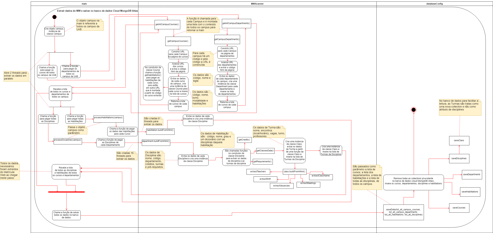

# Modelos Dinâmicos: WebScraper

## Histórico de revisões
|   Data   |  Versão  |        Descrição       |          Autor(es)          |
|:--------:|:--------:|:----------------------:|:---------------------------:|
| 26/04/2019 | 0.1 | Criado documento, adicionado diagrama de sequência, sumário e referências | Joberth Rogers |
| 26/04/2019 | 0.2 | Adicionado versão 1 e 2 do diagrama de atividades, introdução e referências | Daniel Maike |

## Sumário

[1. Introdução](#1-introducao)  
[2. Diagrama de Sequência](#2-diagrama-de-sequencia)  
[3. Diagrama de Atividades](#3-diagrama-de-atividades)  
[4. Diagrama de Estados](#4-diagrama-de-estados)  
[5. Referências](#5-referencias)  

## 1. Introdução

A UML oferece diversos diagramas dinâmicos e dentre eles os mais relevantes são o de Sequência, Colaboração, Atividades e Estados.
O diagrama de sequência representa as particularidades das interações entre os objetos do WebScrapper distribuídos entre várias linhas de vida.
O diagrama de atividades representa o fluxo de ações entre os objetos do WebScrapper, demonstrando as fases em que o código percorre desde o ínicio até o salvamento no banco de dados.
O diagrama de estados demonstra os vários estados que o processo de carregamento da página web para passa pelo WebScrapper.

## 2. Diagrama de sequência

Nesse diagrama de sequência levou-se em consideração a extração dos dados do matricula web até o momento que esses dados serão salvos no banco de dados não relacional MongoDB. Nesse diagrama serão tratado as exceções de conexão em ambas as partes,  além de abordar o relacionamento entre as duas partes importantes do Web Scrapper.

### Versão 1.0

## 3. Diagrama de Atividades

Este diagrama dinâmico busca demonstrar o fluxo entre os objetos do WebScrapper do Unigrade, respresentando um fluxo de ações, com foco nos procedimentos e processos realizados. Ele foi separado entre as três partes existentes no WebScrapper, o MWScanner que é responsável pela extração dos dados, o databaseConfig que é responsável por salvar os dados no banco de dados Cloud MongoDB Atlas e a main que é responsável por juntar a extração e o salvamento no banco de dados. Neste diagrama é demonstrado a partir desta separação o fluxo desde a criação do objeto campus até o salvamento de todos os dados no Atlas.

### Versão 1.0

### Versão 2.0

## 4. Diagrama de Estados

bla bla bla

### Versão 1.0

### 5. Referências

* <https://www.uml-diagrams.org/sequence-diagrams.html>  
* Slide ARQUITETURA E DESENHO DE SOFTWARE aula 11 - Milene Serrano  
* <https://www.uml-diagrams.org/activity-diagrams.html>  