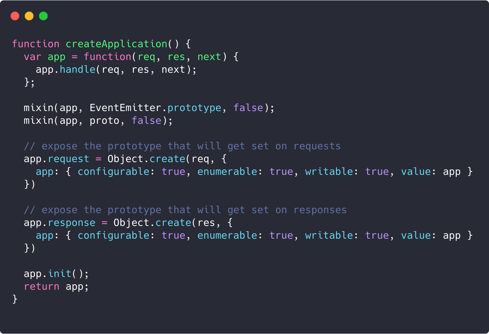
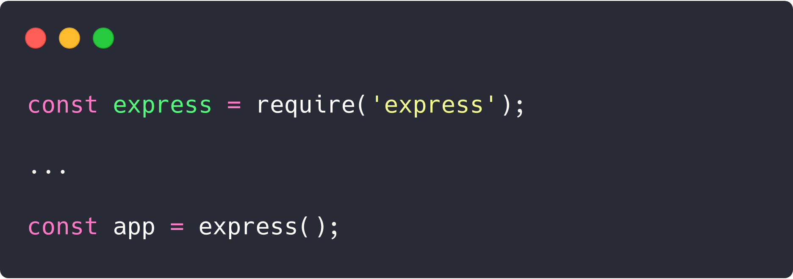

# GRASPs e GoFs: API

## Histórico de revisões
|   Data   |  Versão  |        Descrição       |          Autor(es)          |
|:--------:|:--------:|:----------------------:|:---------------------------:|
| 20/05/2019 | 0.1  | Adicionando Factory Method | Gabriel Carvalho |
| 20/05/2019 | 0.2  | Relacionando com GRASP | Ezequiel Oliveira |
| 20/05/2019 | 0.3  | Reestruturando documento | Guilherme Guy |

## GOFs utilizados
[1. Factory Method](#factory-method)

## GRASPs utilizados
[1. Information Expert ](#information-expert)

## Factory Method

Factory Method é um padrão de projeto criacional que nos permite abstrair detalhes de implementação de criação de objetos do mundo externo. Express faz isso exportando apenas o construtor.

A função do framework que faz a criação da aplicação:  

Importação e chamada da função na API:

### Information Expert:

No trecho de codigo pode-se notar que o express consegue instanciar seu objeto único, considerando-o especialista pois ele tem a responsabilidade de gerar um objeto usado ao longo do codigo.

