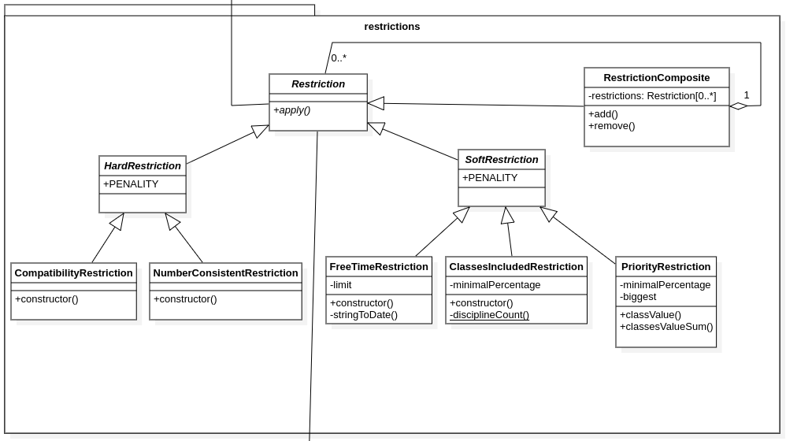
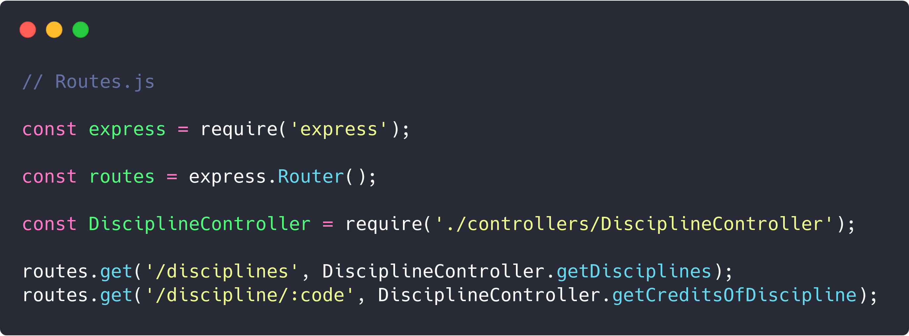

# GRASPs e GoFs: API

## Histórico de revisões
|   Data   |  Versão  |        Descrição       |          Autor(es)          |
|:--------:|:--------:|:----------------------:|:---------------------------:|
| 20/05/2019 | 0.1  | Adicionando Factory Method | Gabriel Carvalho |
| 20/05/2019 | 0.2  | Relacionando com GRASP | Ezequiel Oliveira |
| 27/06/2019 | 0.3  | Reestruturando documento | Guilherme Guy |
| 27/06/2019 | 0.4  | Adicionando GOF Composite | Guilherme Guy |
| 27/06/2019 | 0.5  | Adicionando GRASP Polimorfismo | Guilherme Guy |
| 28/06/2019 | 0.6  | Adicionando GOF Proxy | Gabriel Carvalho |

## GOFs utilizados
[1. Factory Method](#factory-method) 
[2. Composite](#composite)  
[3. Proxy](#proxy)  

## GRASPs utilizados
[1. Information Expert ](#information-expert)  
[2. Polimorfismo](#polimorfismo)  

## Factory Method

Factory Method é um padrão de projeto criacional que nos permite abstrair detalhes de implementação de criação de objetos do mundo externo. Express faz isso exportando apenas o construtor.

A função do framework que faz a criação da aplicação:  

Importação e chamada da função na API:

## Composite
Dentro do módulo *algorithm* podemos encontrar o módulo *restrictions*, que fornece restrições para o algorítimo genético. As restrições foram feitas de forma a seguir o GOF Composite, permitindo sua agregação no composite e facilitando a utilização destes objetos como uma coleção.

## Proxy

No Express.js, as rotas fazem a função de proxy. Elas são responsáveis por interceptar os requests e encaminhar-los aos seus, respectivos, middlewares.

### Information Expert:

Importação e chamada da função na API:

No trecho de codigo pode-se notar que o express consegue instanciar seu objeto único, considerando-o especialista pois ele tem a responsabilidade de gerar um objeto usado ao longo do codigo.

## Polimorfismo

Podemos perceber grande uso do polimorfismo no módulo *restriction*, em que cada classe de Restrictions tem um comportamento único, sendo todas herdeiras da classe Restriction 

