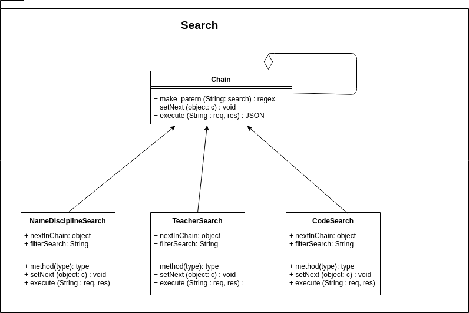

# GRASPs e GoFs: API

## Histórico de revisões
|   Data   |  Versão  |        Descrição       |          Autor(es)          |
|:--------:|:--------:|:----------------------:|:---------------------------:|
| 20/05/2019 | 0.1  | Adicionando Factory Method | Gabriel Carvalho |
| 20/05/2019 | 0.2  | Relacionando com GRASP | Ezequiel Oliveira |
| 27/06/2019 | 0.3  | Reestruturando documento | Guilherme Guy |
| 27/06/2019 | 0.4  | Adicionando GOF Composite | Guilherme Guy |
| 27/06/2019 | 0.5  | Adicionando GRASP Polimorfismo | Guilherme Guy |
| 28/06/2019 | 0.6  | Adicionando GOF Proxy | Gabriel Carvalho |
| 29/06/2019 | 0.7  | Adicionando GOF Chain of responsability | Joberth Rogers |
| 29/06/2019 | 0.8  | Adicionando grasp Baixo acoplamento | Joberth Rogers | 

## GOFs utilizados
[1. Factory Method](#factory-method) 
[2. Composite](#composite)  
[3. Proxy](#proxy)  

## GRASPs utilizados
[1. Information Expert ](#information-expert)  
[2. Polimorfismo](#polimorfismo)  

# GOFS

## Factory Method

Factory Method é um padrão de projeto criacional que nos permite abstrair detalhes de implementação de criação de objetos do mundo externo. Express faz isso exportando apenas o construtor.

A função do framework que faz a criação da aplicação:  

Importação e chamada da função na API:

## Composite
Dentro do módulo *algorithm* podemos encontrar o módulo *restrictions*, que fornece restrições para o algorítimo genético. As restrições foram feitas de forma a seguir o GOF Composite, permitindo sua agregação no composite e facilitando a utilização destes objetos como uma coleção.

## Proxy

No Express.js, as rotas fazem a função de proxy. Elas são responsáveis por interceptar os requests e encaminhar-los aos seus, respectivos, middlewares.

## Chain of responsability

Antigamente no endpoint "search" ao realizar as consultas, executavam-se várias queries encadeada para verificar os possíveis resultados na pesquisa. Devido a esse fator, o código tornou-se altamente acoplado e muito difícil de ser refatorado. Após observar vários padrões de projeto, pode se perceber que o padrão Chain of responsability era um dos padrões que servia como solução para os problemas encontrados acima, pois era necessário consultar o nome da disciplina, nome do professor e código da disciplina no banco de dados de acordo com o body da requisição e o Chain of responsability é um dos padrões que tem como responsabilidade usar a ideia do middleware, passando a responsabilidade para a próxima consulta até o resultado ser encontrado. Após aplicado o padrão, pode-se perceber o quão organizado o código ficou, já que agora estava menor e modularizado, além de menos acoplado. Um ponto forte a se destacar também, é a possibilidade de novas opções de pesquisa que podem ser adicionadas futuramente caso seja necessário, graças a flexibilidade que aplicação do padrão proporciona.

# Grasps

## Information Expert:

Importação e chamada da função na API:

No trecho de codigo pode-se notar que o express consegue instanciar seu objeto único, considerando-o especialista pois ele tem a responsabilidade de gerar um objeto usado ao longo do codigo.

## Polimorfismo

Podemos perceber grande uso do polimorfismo no módulo *restriction*, em que cada classe de Restrictions tem um comportamento único, sendo todas herdeiras da classe Restriction 

## Baixo acoplamento

Podemos perceber o uso desse Grasp no Chain of responsability, devido ao grau de independência entre cada elemento da "chain". Nenhum desses elemento sabem da existência do outro, apenas passa a responsabilidade para o proximo, caso o elemento atual que irá tratar a resquisição não atenda as regras de negócio estabelecidas. 

