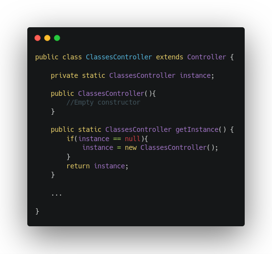
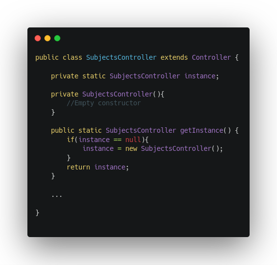
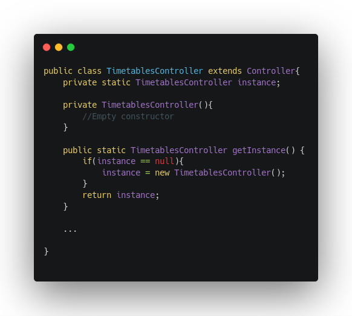
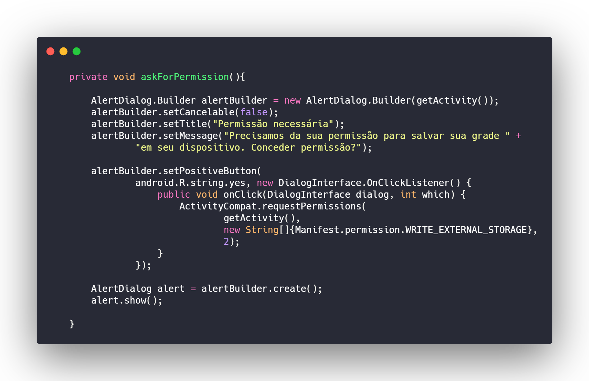
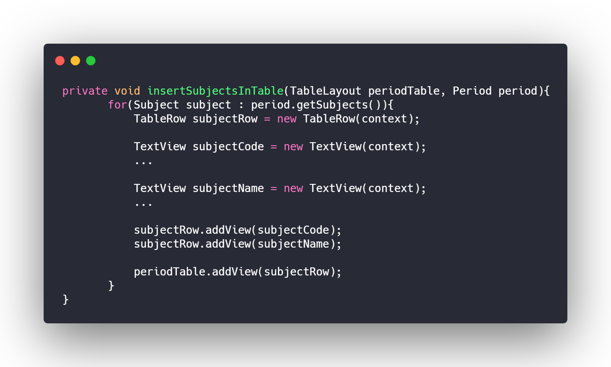
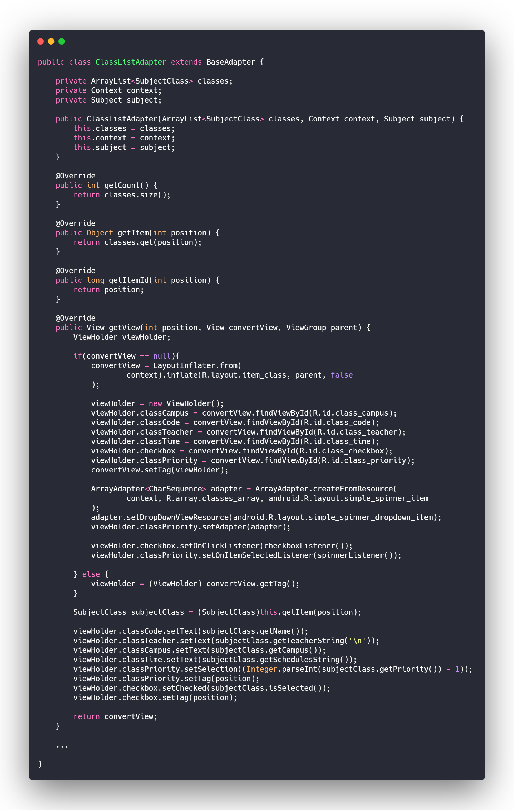
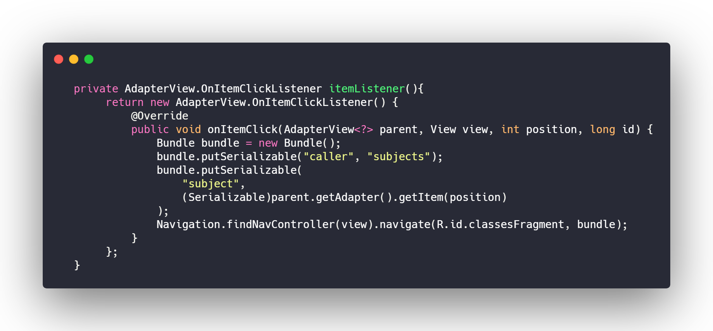

# GRASPs e GoFs: App

## Histórico de revisões
|   Data   |  Versão  |        Descrição       |          Autor(es)          |
|:--------:|:--------:|:----------------------:|:---------------------------:|
| 15/05/2019  | 1.0   | Introdução sobre os GoF's criacionais  |  Guilherme Aguiar|
| 19/05/2019  | 2.0   | Padrões Singleton do projeto  |  Guilherme Aguiar|
| 20/05/2019  | 3.0   | Grasp Especialista  |  Guilherme Aguiar|
| 25/06/2019  | 3.1   | Adicionando GoFs e GRASPs  |  Geovana Ramos |
| 26/06/2019  | 3.2   | Adicionando imagens  |  Gabriela Medeiros|
| 27/06/2019  | 3.3   | Substituindo imagens por códigos fonte  |  Geovana Ramos|
| 27/06/2019  | 3.4   | Adicionando polimorfismo  |  Geovana Ramos|

## GOFs utilizados
[1. Singleton](#singleton-)  
[2. Builder](#builder)  
[3. Composite](#composite)  
[4. Adapter](#adapter)  
[5. Observer](#observer)  

## GRASPs utilizados
[1. Controller](#controller)  
[2. Polimorfismo](#olimorfismo)  

## Singleton
O objetivo do Singleton é permitir apenas uma instanciação de classe e fornecer um método para recuperá-la.
Esse padrão de projeto foi implementado nas camadas dos controladores (_controller_) no contexto da arquitetura MVC. Os controllers são instanciados e utilizados pontualmente de maneira similar, em chamadas assíncronas e em fragments, que manipulam a interface.

#### Subjects Controller
Controller responsável por retornar a lista de todas matérias da API.

#### Classes Controller
Controller responsável por retornar a lista de todas turmas da API.

#### TimeTables Controller

## Builder
O padrão Builder não foi implementado manualmente, porém o Android faz uso desse para padrão a geração de janelas de alerta. Ele disponibiliza o builder para que a janela de alerta seja criada facilmente. Ele está sendo utilizado para avisar ao usuário que o app necessita de sua permissão para salvar a grade em seu celular.

## Composite
Grande parte dos elementos gráficos do Android herdam de uma classe chamada "View". Considerando que cada tela do aplicativo possui layouts compostos por outros objetos gráficos, como botões e listas, e que ambos são "_views_", podemos observar um _composite_ em tal relação.

Por exemplo, na tabela de fluxos, um TableLayout irá armazenar várias TableRows e uma TableRow irá armazenar vários objetos TextView, ImageViews etc. Ou seja, uma table tem várias linhas e cada linha pode ter diversos tipos de componentes gráficos.

## Adapter
Como parte da arquitetura Android, os adapters são responsáveis por modificar os elementos gráficos de uma lista. Uma lista básica pode receber exclusivamente strings únicas, porém o adapter pode modificá-la para receber outros tipos e combinação de dados e _views_, como: múltiplas strings, imagens, checkbox, botões, etc.
Na utilização abaixo, o adapter modifica a lista para poder aceitar uma checkbox, um spinner e múltipas strings. Esses elementos serão preenchidos com os dados de cada turma de uma matéria.

## Observer
O padrão observer foi implementado por meio dos listeners. Os listeners são métodos que aguardam a interação do usuário com algum elemento da tela (botões, _checkbox_, _spiners_, entre outros) para executar os comandos já determinados. No caso abaixo, essa função retorna o listener de cada matéria listada. Ao clicar em uma delas, a função é chamada. A mesma salva os dados da matéria e envia para a nova tela que será apresentada ao usuário logo em seguida.

## Controller
Os controllers do app são responsáveis por guardar as funções mais pesadas e de interação com a api. Dessa forma, a manutenção e execução de testes é facilitada.

## Polimorfismo
Todos os controllers herdam de uma classe base controller que possui um método base para todos os módulos do projeto (ver imagens no tópico Singleton)
