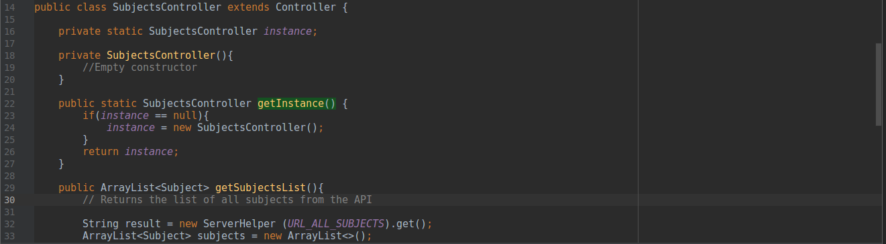
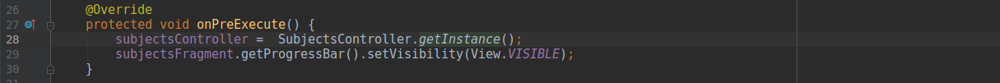
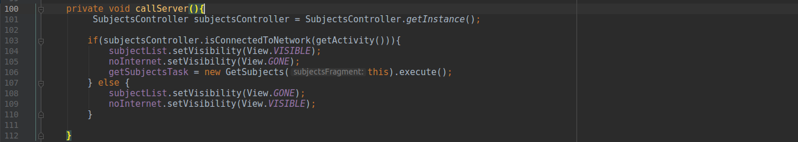
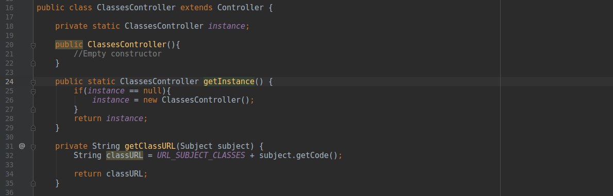
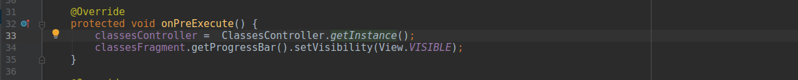
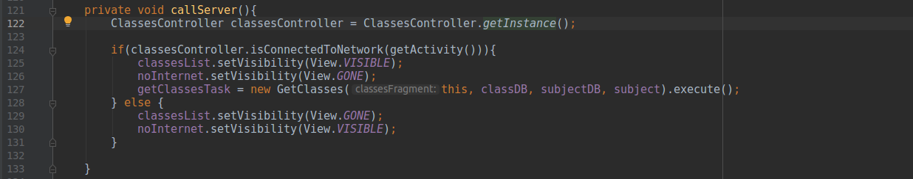
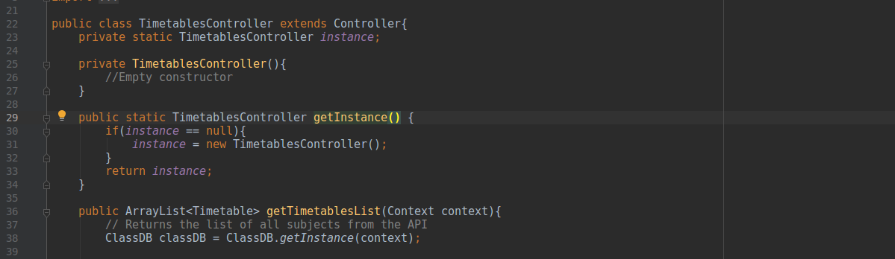
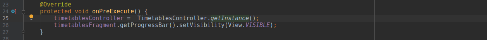
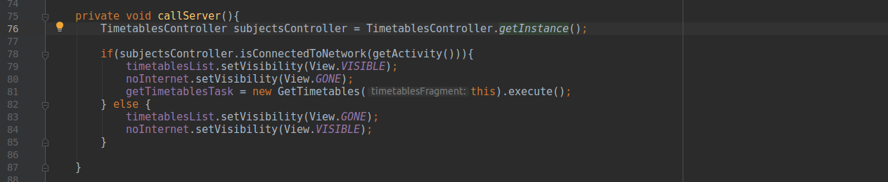

# GRASPs e GoFs: App

## Histórico de revisões
|   Data   |  Versão  |        Descrição       |          Autor(es)          |
|:--------:|:--------:|:----------------------:|:---------------------------:|
| 15/05/2019  | 1.0   | Introdução sobre os GoF's criacionais  |  Guilherme Aguiar|
| 19/05/2019  | 2.0   | Padrões Singleton do projeto  |  Guilherme Aguiar|
| 20/05/2019  | 3.0   | Grasp Especialista  |  Guilherme Aguiar|

## Sumário
<ul>
    <li>[1. GoF's Criacionais ](#1-gofs-criacionais)</li>
        <ul>
            <li>[1.1 Singleton](#11-singleton)</li>
        </ul>
</ul> 

-----

## 1. GoF's Criacionais
Em um sistema orientado a objetos, a criação de certos objetos pode ser uma tarefa extremamente complexa. Podemos destacar dois problemas relacionados a criação de objetos: 

 * definir qual classe concreta deve ser utilizada para criar o objeto e definir como os objetos devem ser criados.
 * definir como eles se relacionam com outros objetos do sistema.

Seguindo o princípio do encapsulamento, essa complexidade deve ser isolada. A seguir são apresentados os padrões de projeto criacionais apresentados no Aplicativo Android Unigrade.

## 1.1 Singleton
O objetivo do Singleton é permitir a criação de uma única instância de uma classe e fornecer um modo para recuperá-la.
Esse padrão de projeto foi implementado nas camadas dos controladores da nossa arquitetura MVC. Os controllers são instanciados e utilizados pontualmente de maneira similar, em chamadas assíncronas e em fragments, que manipulam a interface.
###Subjects Controller

Controller responsável por retornar a lista de todas matérias da API.

###Classes Controller

Controller responsável por retornar a lista de todas turmas da API.

###TimeTables Controller

### GRASP's Relacionados:

#### Information Expert:

Aos nossos controllers mostrados acima, podem ser considerados classes especialistas, por que a ele foi dada a responsabilidade fazer algo a si mesmo, que é instanciar e mantar seu objeto único, e também controlar ou coordenar atividades entre as views e as models.

