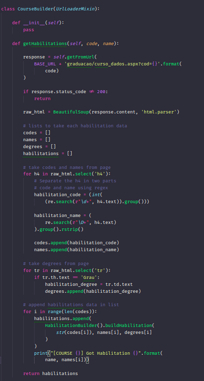
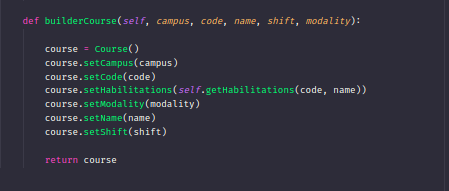

# GRASPs e GoFs: WebScraper

## Histórico de revisões
|   Data   |  Versão  |        Descrição       |          Autor(es)          |
|:--------:|:--------:|:----------------------:|:---------------------------:|
|  20/05/2019 |  0.1 | Iniciação do documento  |  Joberth Rogers|

## Sumário
[1. Introdução](#1-introducao)  
[2. Singleton](#2-singleton)  
[3. Builder](#3-builder)  
[Referências](#referencias)  

# 1. Introdução

Como apresentado em dinâmicas passadas, o script do mwscanner foi começado nas primeiras sprints por ser uma das vertentes do projeto crucial para o andamento final do Unigrade, onde seu objetivo é coletar todos os dados relacionados a vida acadêmica da Universidade de Brasília. Por ser algo tão breve e importante para ser feito logo, o grupo entrou em um concesso de apenas se preocupar em criar o script de forma otimizada e funcional, não se importando com a arquitetura e qualquer tipo de padrão, devido a conhecimentos ainda não ensinados pela professora, mas nas últimas sprints  esses conceitos foram absorvidos e relatados no decorrer das semanas. Como primeiro passo na dinâmica, o grupo se preocupou em aplicar padrões relacionados ao grupo de padrões criacionais, onde se tem o objetivo de saber como os objetos estão sendo criados, se sua instância é frequente  e  desnecessária em alguns caso, ou atribuição de responsabilidades de classes para outra de forma a desacoplar a arquitetura e melhorar a performance. Os padrões levantados e adequados ao Mwscanner foram: 

# 2. Singleton

Esse padrão que por muitos autores até hoje é considerado como anti-pattern, para o script Mwscaner foi um fator que alavancou sua performance de forma muito considerável. Como o script faz a coleta de vários dados do Matrícula Web e salva todos no banco de dados não relacional, ao executar o script resultava em uma grande perda de performance na hora de salvar esses dados, devido à criação de uma instância do MongoDB a cada vez que uma nova divisão do Matrícula web era iniciada. Então foi necessário o uso do padrão singleton, para cuidar da criação de uma única instância no começo da execução do script. Aumentando a performance do programa e evitando a criação de objetos relacionados a conexão com o banco de dados de modo desnecessário. O código referente ao singleton está presente abaixo:
    

Ao aplicar o padrão tivemos a queda no tempos 
de execução da build de: 

Para: 

Ou seja, o nível de satisfação do padrão foi ótimo na aplicação do script, obtendo
resultados muito favoráveis e destruído o gargalo na hora da conexão do banco. 

 Para verificar os links da build, acesse:  
  <a href="https://gitlab.com/ads-unigrade-2019-1/MWScanner/-/jobs/214912533"> https://gitlab.com/ads-unigrade-2019-1/MWScanner/-/jobs/214912533 </a>  
  <a href="https://gitlab.com/ads-unigrade-2019-1/MWScanner/-/jobs/203499362"> https://gitlab.com/ads-unigrade-2019-1/MWScanner/-/jobs/203499362 </a>

# 3. Builder

Como abordado na definição, o padrão do tipo builder tem por objetivo tentar encapsular a lógica de construção dos objetos criados, devido a complexidade da criação deles, que em alguns casos podem ser muito alta. Portanto, esse padrão tenta isolar a forma que os passos da criação do objeto tomam, a fim de criar objetos de forma simples para a aplicação tornando o código e as estrutura mais agradável e de fácil manutenção (assim botando ordem ao caos). Exemplo de um trecho de código no mwscanner envolvendo builder: 

 

# Referências

* Slide padrões GOF - disciplina de Arquitetura e Desenho de Software da UnB-Gama - Professora: Milene Serrano