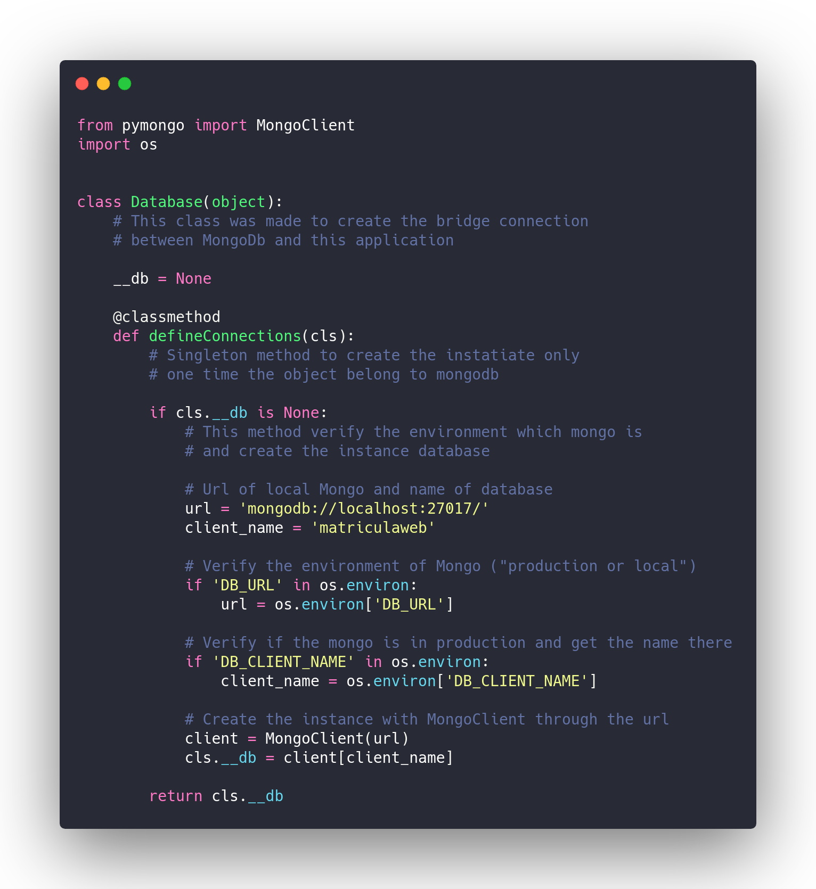
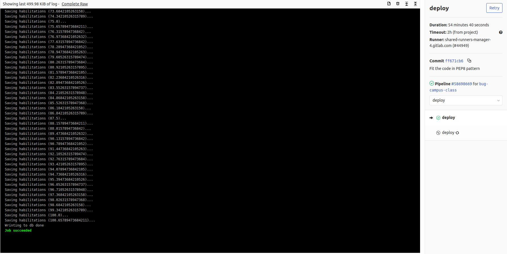
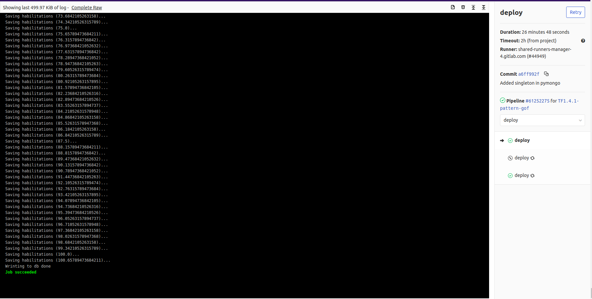
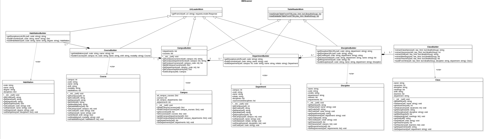
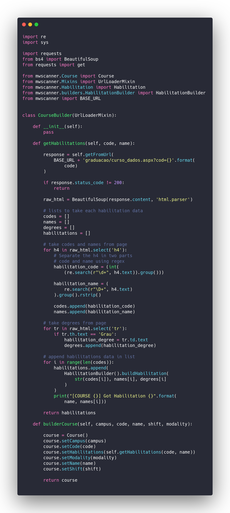
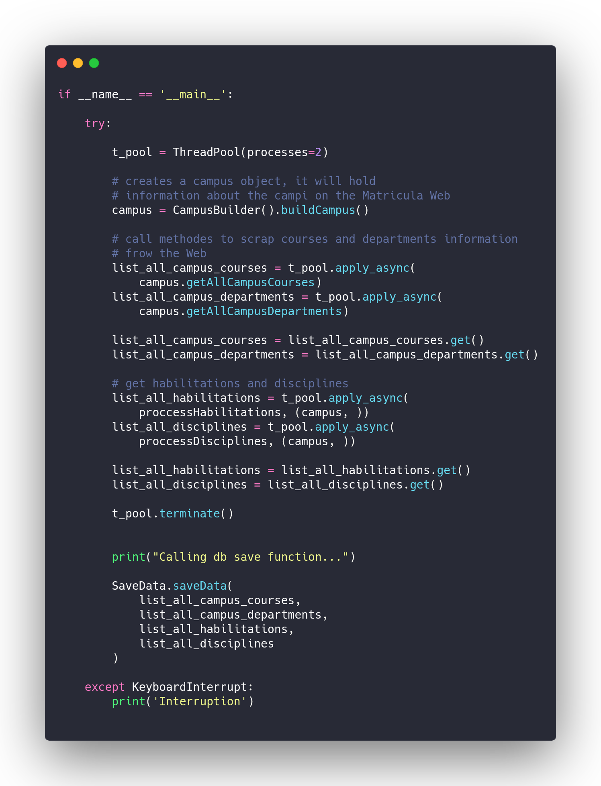
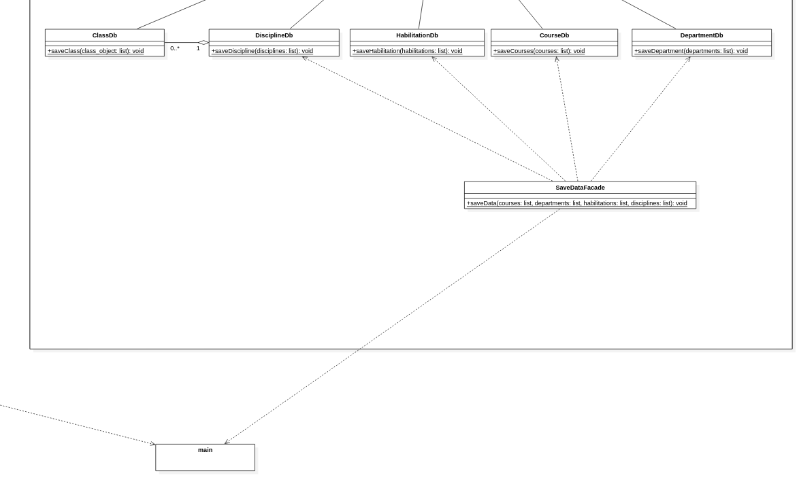

# GRASPs e GoFs: WebScraper

## Histórico de revisões

|   Data   |  Versão  |        Descrição       |          Autor(es)          |
|:--------:|:--------:|:----------------------:|:---------------------------:|
|  20/05/2019 |  0.1 | Iniciação do documento  |  Joberth Rogers|
|  24/06/2019 |  0.2 | Adição dos padrões GRASP  |  Daniel Maike |
|  26/06/2019 |  0.3 | Adição do padrão Object Pool  |  Daniel Maike |
|  26/06/2019 |  1.0 | Adição do padrão Facade  |  Daniel Maike |
| 26/06/2019 | 1.1 | Melhorando textos | Joberth Rogers |

## Sumario

### 1. Introdução
* [Introdução](#1-introducao)  

### 2. GOFs utilizados

* [Singleton](#21-singleton-gof-criacional)  
* [Builder](#22-builder-gof-criacional)  
* [Object Pool](#23-object-pool-criacional-nao-gof)  
* [Facade](#24-facade-gof-estrutural)  

### 3. GRASPs utilizados

* [Padrões GRASP](#3-padroes-grasp)  

### 4. Referências encontradas

* [Referências](#4-referencias)  

# 1. Introdução

Como apresentado em dinâmicas passadas, o script do Mwscanner foi desenvolvido logo nas primeiras sprints envolvendo código, devido a crucialidade da funcionalidade para o andamento do projeto. O Mwscanner tem por objetivo coletar todos os dados relacionados a vida acadêmica da Universidade de Brasília. Por ser algo urgente e de extrema importância, o grupo se preocupou apenas em criar um script funcional, não se importando com a arquitetura e qualquer tipo de padrão de projeto no início do desenvolvimento, já que o conhecimento ainda não tinha sido ensinado pela professora na época da criação da funcionalidade. Nas últimas semanas esses conceitos foram absorvidos e os mais adequados foram abstraídos para o MWscanner. Os padrões levantados foram: 

# 2. Padrões GOF

Os Padrões GOF utilizados no projeto foram:

## 2.1 Singleton (GOF Criacional)

Esse padrão de projeto que por muitos autores é considerado como anti-pattern, para o script Mwscaner foi um fator crucial para o aumento do desempenho do script. Como o script lida com a coleta e  o salvamento dos dados no banco de dados, havia uma diminuição no desempenho logo ao executar o script, devido à criação de uma instância do objeto de conexão com o MongoDB a cada vez que uma nova etapa do Matrícula Web era visitada. Logo foi necessário o uso do padrão de projeto Singleton para cuidar da criação de uma única instância no começo da execução do MWscanner, no qual seria usada por quem necessitasse durante todo o fluxo de execução. Caso alguma das partes necessitassem da conexão com o banco de dados, usaria o objeto já instanciado, aumentando assim a performance do programa e evitando a criação de objetos relacionados a conexão com o banco de dados de modo desnecessário. O código referente ao Singleton está presente abaixo:
   

  Ao aplicar o padrão tivemos a queda no tempos de execução da build de:

  Para:

  Ou seja, o nível de satisfação do padrão foi ótimo na aplicação do MWScanner, obtendo resultados favoráveis e destruindo o gargalo na hora da conexão do banco.
  Com a aplicação do padrão Singleton o tempo caiu em média de 50%.

 Para verificar os links da build, acesse:
   
  <a href="https://gitlab.com/ads-unigrade-2019-1/MWScanner/-/jobs/214912533">
    Depois da aplicação do padrão https://gitlab.com/ads-unigrade-2019-1/MWScanner/-/jobs/214912533
  </a>
   
  <a href="https://gitlab.com/ads-unigrade-2019-1/MWScanner/-/jobs/203499362">
    Antes da aplicação do padrão https://gitlab.com/ads-unigrade-2019-1/MWScanner/-/jobs/203499362
  </a>

## 2.2 Builder (GOF Criacional)

  Como abordado na definição, o padrão do tipo builder tem por objetivo tentar encapsular a lógica de construção dos objetos criados, devido a complexidade da criação deles, que em alguns casos podem ser muito alta. Portanto, esse padrão tem como objetivo separar o processo de construção de um objeto de sua representação e permitir sua criação passo-a-passo, a fim de criar objetos de forma simples para a aplicação tornando o código e as estrutura mais agradável e de fácil manutenção.

Exemplo de um trecho de código no MWScanner envolvendo Builder:  

## 2.3 Object Pool (Criacional, não GOF)

  O padrão Object Pool tem o objetivo de reduzir o tempo e custo das instanciações, reaproveitando objetos, melhorar o desempenho e o controle sobre os recursos. Devido grande quantidade de dados que o MWScanner trata é necessário a criação de threads para que diminua o tempo de execução do script. Instanciar um objeto requer tempo de processamento do computador, e para isto as Threads são criadas e reutilizadas, o Thread Pool é um exemplo de Object Pool.

Exemplo de  trecho de código no MWScanner envolvendo o Object Pool:  

## 2.4 Facade (GOF Estrutural)

  O padrão GOF estrutural Facade tem como objetivo prover uma interface simplificada para a utilização de várias interfaces de um subsistema. No MWScanner após a extração dos dados, é necessário que eles sejam salvos em um banco de dados não relacional MongoDB, hospedado no Atlas, nesse processo a main chama a classe SaveDataFacade para que ela possa interagir com as classes responsáveis por salvar cada Collection no banco de dados.

# 3. Padrões GRASP

**G**eneral **R**esponsibility **A**ssignment **S**oftware **P**rinciples – Princípios Gerais do Software de Atribuição de Responsabilidade

Representam os princípios e o racicínio utilizado para atribuir responsabilidades de objetos que podem ser descritos de modo metódico, explicável e repetível.

Os padrões GRASP utilizados no projeto foram:

* Criador;
* Especialista;
* Invenção Pura;
* Baixo Acoplamento;
* Alta Coesão;
* Indireção.

Descritos a seguir:

O padrão GRASP **Criador**, em que se determina a responsabilidade da criação da instância de um objeto a uma classe, é visualizado nas classes do Builder do MWScanner, elas são responsáveis por criar instancias das classes em que elas possuem os dados, também é visualizado o padrão GRASP **Especialista**, com a atribuição de responsabilidade de criar instancia de classe nas classes do Builder.

O padrão GRASP **Invenção Pura** é uma classe que não representa um conceito no domínio do problema, especialmente criado para alcançar baixo acoplamento, alta coesão e o potencial de reutilização. Com isto é visualizado o GRASP **Invenção Pura** nos Mixins que são classes que não são classes exatamente necessárias no projeto mas que foram criadas para aumentar o potencial de reutilização pelas classes de extração de dados do Matricula Web, com isso, é visto o GRASP **Baixo Acoplamento** por diminuir o acoplamento com a distribuição de responsabilidades entre as classes e aumento da coesão (GRASP **Alta Coesão**) e do uso do GRASP **Especialista** com classes focadas em suas responsabilidades, classes que não realizam grande volume de trabalho.

O padrão GRASP **Indireção** é a utilização de uma classe intermediária para melhor distribuição das responsabilidades e evitando um acoplamento direto. É possível observar nas classes de salvamento dos dados, cada Collection possui uma classe em que pega os dados extraídos pelo Webscraper e os coloca na forma esperada a ser salva nas Collections do banco de dados MongoDB Atlas, cada classe é responsável por uma Collection e depois a classe saveData salva o que vem de cada classe para o banco de dados. Também possui uma Indireção entre as turmas e as disciplinas, para a classe de salvamento das discplinas não ficar com um grande volume de trabalho, foi criada uma classe para tratar das turmas e já devolver a classe das disciplinas da forma esperada. A **Indireção** também fortalece a responsabilidade de cada classe, divide as responsabilidades para não deixar grande volume de trabalho para cada classe. Com isto, também fortalece os GRASPS de **Alta Coesão**, **Baixo Acoplamento** e o **Especialista**, esses três colaboram um com o outro dentro do projeto.

# 4. Referências

* Slide padrões GOF - disciplina de Arquitetura e Desenho de Software da UnB-Gama - Professora: Milene Serrano