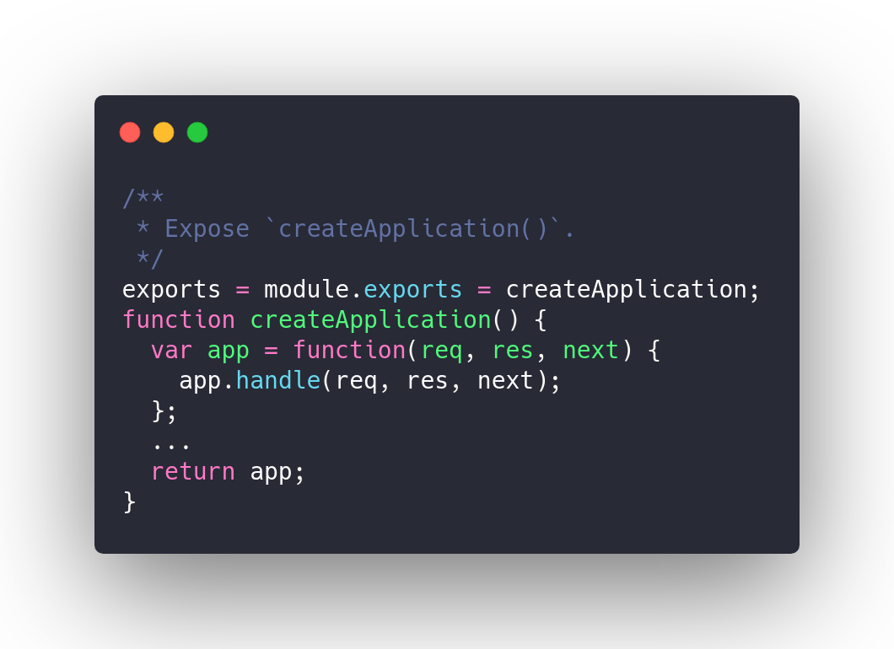
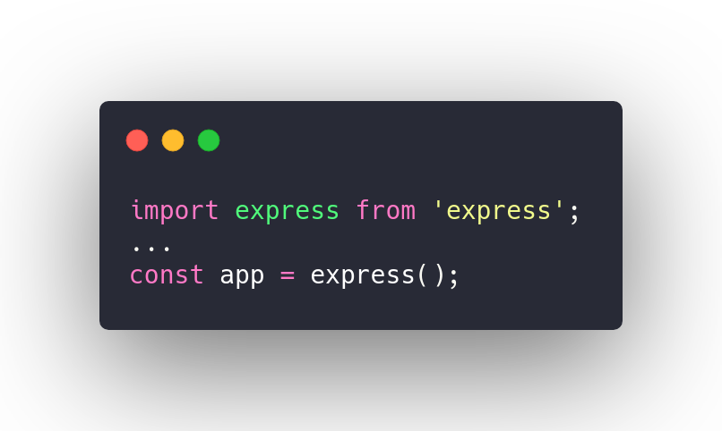
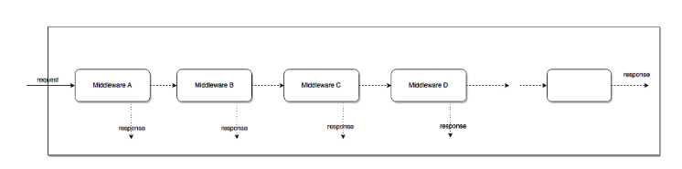
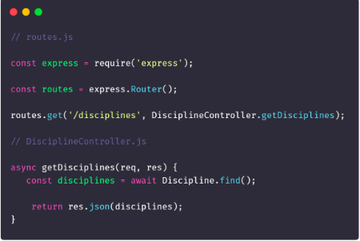
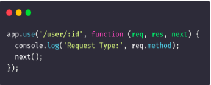
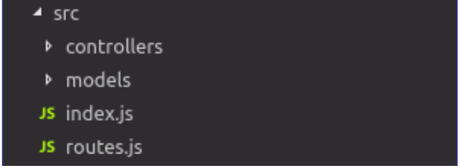
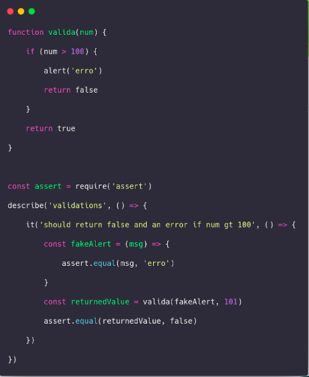

# Padrões Emergentes: API

## Histórico de revisões
|   Data   |  Versão  |        Descrição       |          Autor(es)         |
|:--------:|:--------:|:----------------------:|:---------------------------:|
| 25/05/2019  | 0.1  | Criando introdução  | Guilherme Deusdará |
| 25/05/2019  | 0.1  | adicionando padrão Factory  | Guilherme Deusdará |
| 29/06/2019  | 0.2  | Alterando codigo para imagem carbon | Joberth Rogers |
| 29/06/2019 | 0.3 | Adicionando padrões não documentados e apresentados nos slides | Joberth Rogers |

## Sumário
[1.Introdução](#1-Introdução)  
[2.Factory Method ](#2-factory-method)  
[3.Middleware ](#3-middleware)  
[4.Model Controller ](#4-model-controller)  
[5.Dependecie Injection ](#5-dependency-injection)  
[6.Event Emmiter ](#6-event-emmiter)  

## 1. Introdução

O Express é uma framework de aplicações Web pada Node.js, que é minimalístico e flexível e fornece um conjunto robusto de recursos para aplicativos da Web e móveis.

Abaixo estão alguns padrões de projeto emergentes que podemos ver ao trabalhar com o Express.js

## 2. Factory method

Este é um padrão de design simples e comum em JavaScript. Factory é um padrão de projeto *criacional* que nos permite abstrair detalhes de implementação de criação de objetos do mundo externo. Express faz isso exportando apenas o criadorf.

E usar a Factory para criar uma aplicação expressa é tão simples quanto isto:

## 3. Middleware

Este padrão emergente é muito usado no Express. A cada vez que uma requisição é feita na API, ela passa pela lista de middlewares presentes. Cada middleware contém uma regra de négocio diferente. Caso o objeto atenda aos requisitos abordados pelo middleware, uma resposta é retornada ao cliente da requisição e isso é persistido até o final dos middleware existentes, modelando a requisição de acordo como o express foi configurado. 

Um exemplo de middlerare na aplicação está no código a seguir:

## 4. Model Controller

Devido ao padrão REST da API, a arquitetura implementada pelo grupo foi o padrão MC (Model, Controller) adaptado do padrão MVC (Model, View, Controller). O motivo desse padrão ser implementado é porque a View é determinada por nosso cliente que é resposavel por renderizar os dados processados pela API e como a API tem a responsabilidade apenas de processar, salvar e consultar dados na banco de dados, não havia lugar para essa camada, então foi persistido apenas a Model e a Controller.

## 5. Dependency Injection

 No decorrer do ciclo de vida de um software, há fases que lidamos com depêndencias na criação de um objetos com outros na hora de se modelar o sistema e muita das vezes isso pode ser a causa de alta acoplação no código desenvolvido. O dependency injection tem por objetivo criar os elementos de dependencias antes da criação dos elementos dependentes, passando todas as dependências por referência. Essas dependencias podem ser "injetadas" usando tanto o metódo construtor da classe, como os métodos setters na aplicação. Esse padrão é muito usado no contexto de testes de software.

Exemplo de uma aplicação do padrão dependencie injection:

 

## 6. Event Emmiter

Padrão de projeto usado nas situações em que é preciso emitir eventos/respostas para cada resultado possível. Muito usado nas rotas de api REST.

 