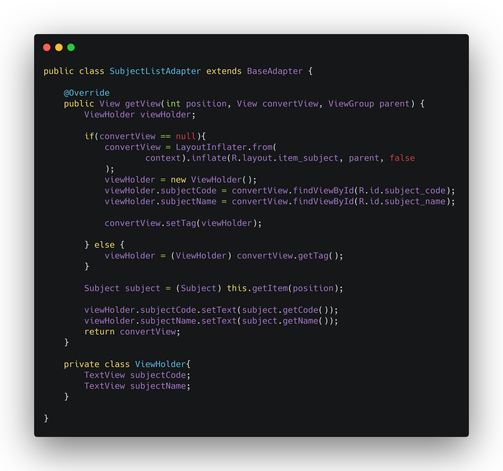

# Padrões Emergentes: App

## Histórico de revisões
|   Data   |  Versão  |        Descrição       |          Autor(es)          |
|:--------:|:--------:|:----------------------:|:---------------------------:|
| 29/06/2019 |  1.0 | Sumário e Padrão ViewHolder | Gabriela Medeiros |

## Padrões Emergentes Utilizados
[1. ViewHolder](#viewholder)  

## ViewHolder
ViewHolder é um padrão que busca o armazenamento de views quando em sua primeira utilização para que em posterior necessidade de uso serem reutilizadas. O padrão aumenta a performance da aplicação ao impedir a repetição excessiva de consultas à view, oferecendo a possibilidade um único acesso a ela.

