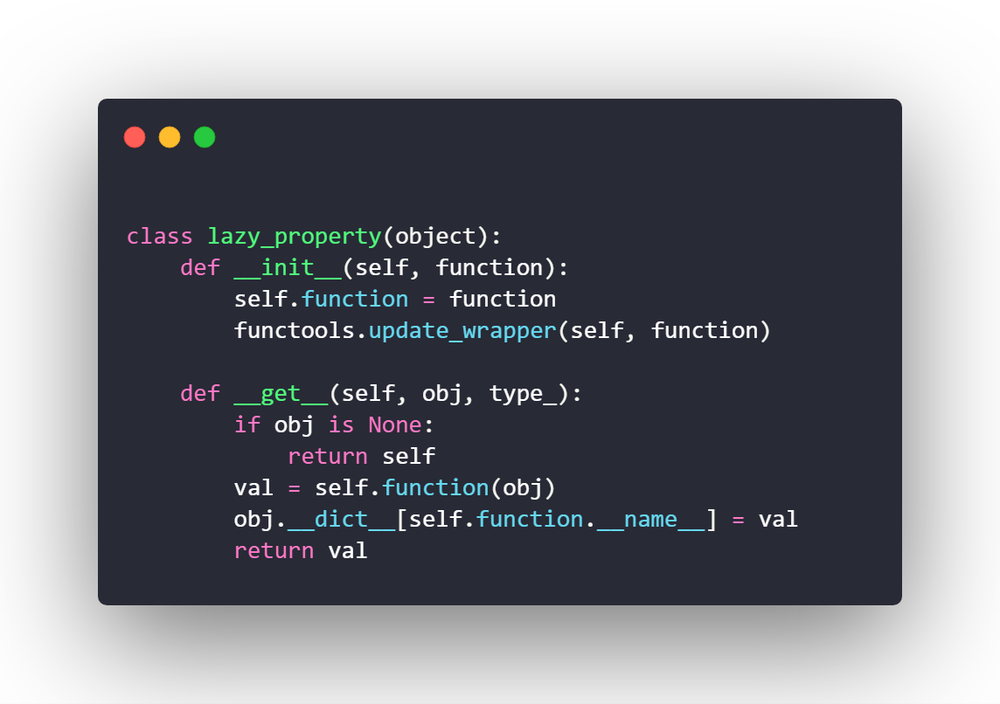
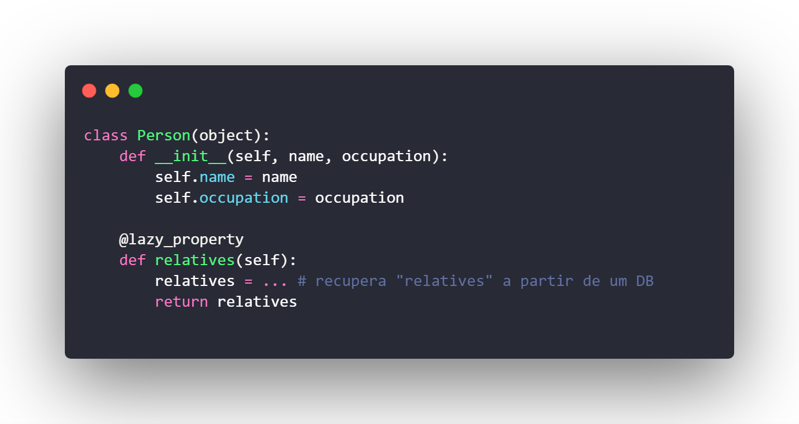
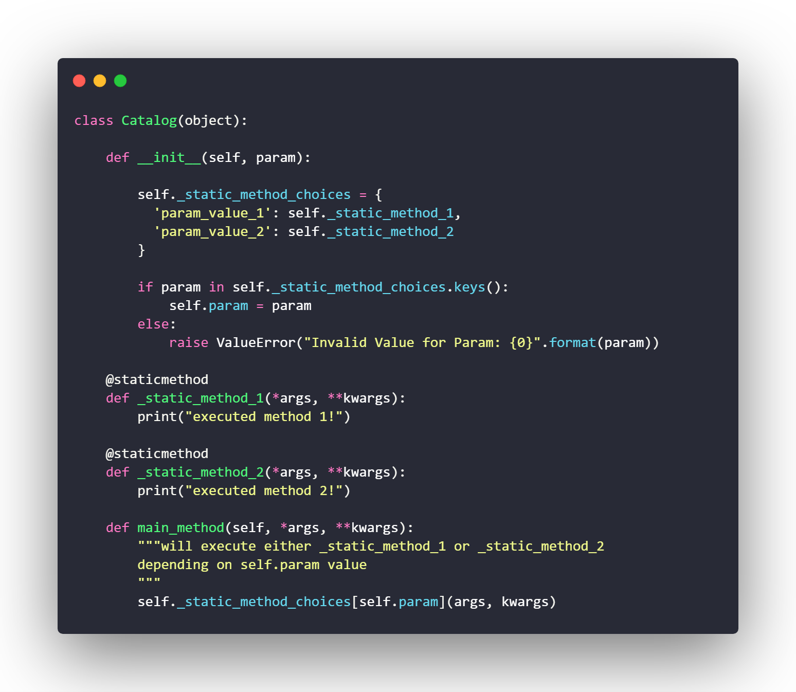

# Padrões Emergentes: WebScraper

## Histórico de revisões
|   Data   |  Versão  |        Descrição       |          Autor(es)          |
|:--------:|:--------:|:----------------------:|:---------------------------:|
| 30/06/2019 | 1.0 | Adição dos padrões apresentados | Guilherme Guy |

## Sumário
[1. Introdução](#1-) 
[1. Lazy Evaluation](#2-)  
[2. Catalog](#3-)  

# 1. Introdução

A seguir se encontram padrões relacionados ao Python. Ambos os padrões estão presentes em outras linguagens, entratando foi decidido apresentá-los como padrões em Python por causa de sua facilidade de implementação e utilização na linguagem.

# 1. Lazy Evaluation

O padrão Lazy Evaluation tenta atrasar ao máximo o processamento de alguma operação. Geralmente esse momento é quando o resultado dessa operação é finalmente utilizado. Além disso o resultado da operção é salvo para que ela não precise ser feita duas vezes. É um padrão muito útil para aumentar o desempenho de aplicações que tenham algorítimos complexos ou etapas demoradas de obtenção de dados. Também é muito utilizado no paradigma de programação funcional.

Exemplo de código:

# 2. Catalog

Este padrão é parecido com o padrão Strategy. Ele consiste em um objeto que tem seu comportamento definido dentre uma gama de opções no momento de criação de uma instancia. Geralemtne são implementados alguns métodos estáticos e um deles é passado como parâmetro ao construtor para que o obejeto concreto o utilize em sua execução.

Exemplo de código:

