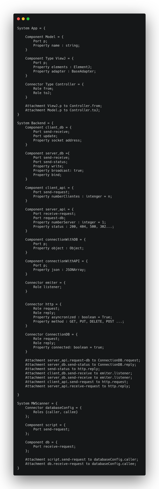

# Architecture description language (ADL)

## Histórico de revisões
|   Data   |  Versão  |        Descrição       |          Autor(es)          |
|:--------:|:--------:|:----------------------:|:---------------------------:|
|10/06/2019|    0.1   | Iniciando documento | Joberth Rogers |
|23/06/2019|    0.2   | Desenvolvimento do documento | Joberth, Geovana, Gabriela |

## Sumário
[1. Introdução](#introducao)  
[1. ACME](#acme)  
[2. Referências](#referencias) 

## Introdução

Com a necessídade de representação de notações de arquitetura e modelagem cada vez mais formais, foram criada a 
notaçã do tipo ADLs (Architecture description language), e os conjuntos de ferramenta que as acompanham. A modelagem
ADL nada mais é que uma linguagem formal de descrição arquitetural que pode ser usada para representar arquiteturas de sistema de software.  

## ACME

A ACME foi criada para considerar os conceitos essenciais comuns a diferentes ADLs e permitir extensões para incluir outros elementos.
Apesar de não ser considerada estritamente uma arquitetura ADL, serve como ponte para diferentes tipos de arquiteturas de software.

## Referências

* Almeida, Jucimar, **UM CONJUNTO DE CARACTERÍSTICAS DESEJÁVEIS EM
UMA ADL ORIENTADA A ASPECTOS** 2007, 168f. Dissertação de pós-graduação, Universidade Estadual de Maringá, 2007.  