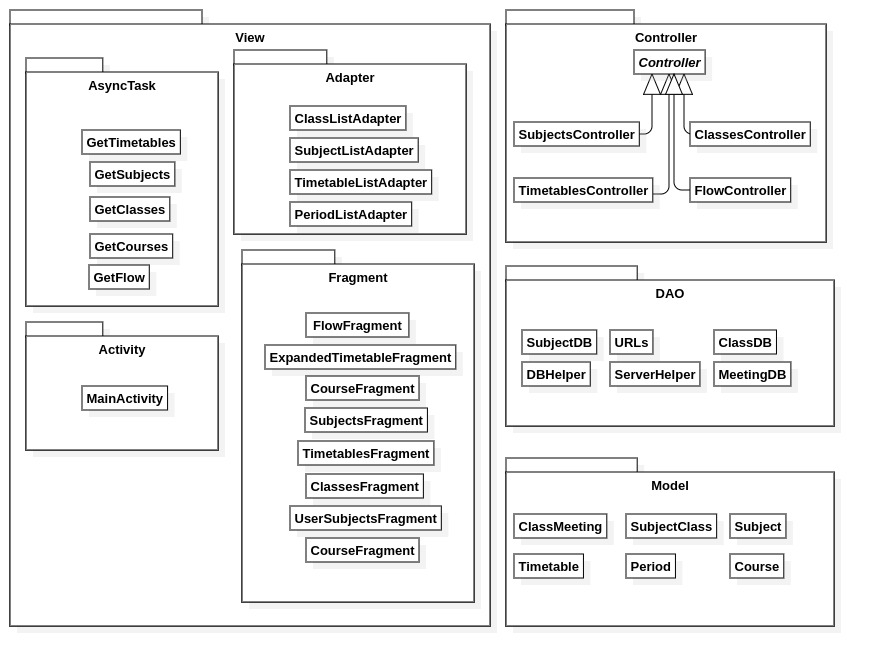

# Documento de Arquitetura de Software

## Histórico de Revisão

| Data | Versão | Descrição | Autor(es) |
|:--------:|:--------:|:----------------------:|:------------------:|
| 10/06/2019 | 0.1 | Criação do Documento e Adição do template e do sumário | Daniel Maike |
| 11/06/2019 | 0.2 | Adição do tópico de Introdução | Daniel Maike |
| 11/06/2019 | 0.3 | Adição do tópico de Representação Arquitetural | Daniel Maike, Guilherme Guy |
| 11/06/2019 | 0.4 | Adição do tópico de Restrições e Metas Arquiteturais | Daniel Maike, Guilherme Aguiar |
| 11/06/2019 | 0.5 | Adição do tópico de Visão de Casos de Uso | Daniel Maike, Guilherme Aguiar |
| 12/06/2019 | 0.6 | Adição do tópico de Visão Lógica | Guilherme Guy, Daniel Maike |
| 13/06/2019 | 0.7 | Adição do tópico de Visão de Dados | Daniel Maike | 15/06/2019 | 0.8 | Adição do tópico de Visualização da Implementação | Gabriel Carvalho |
| 15/06/2019 | 0.9 | Ajuste de Escopo do Projeto | Guilherme Deusdará |
| 15/06/2019 | 0.10 | Ajuste Representação Arquitetural da Api | Guilherme Deusdará |
| 16/06/2019 | 0.11 | Adição do tópico Visão de Implementação | Ezequiel De Oliveira Dos Reis|
| 16/06/2019 | 0.12 | Adição do tópico Tamanho e Desempenho | Ezequiel De Oliveira Dos Reis |
| 18/06/2019 | 0.13 | Correção no tópico de Representação Arquitetural | Daniel Maike, Guilherme Guy |
| 18/06/2019 | 0.14 | Correção no tópico de Visão de Implementação | Daniel Maike, Guilherme Guy |

## Sumário

[1. Introdução](#1-introducao)  
[1.1 Objetivo](#11-objetivo)  
[1.2 Escopo](#12-escopo)  
[1.3 Definições, Acrônimos e Abreviações](#13-definicoes-acronimos-e-abreviacoes)  
[1.4 Referências](#14-referencias)  
[1.5 Visão Geral](#15-visao-geral)  
[2. Representação Arquitetural](#2-representacao-arquitetural)  
[2.1 MWScanner](#21-mwscanner)  
[2.2 API](#22-api)  
[2.3 App](#23-app)  
[3. Restrições e Metas Arquiteturais](#3-restricoes-e-metas-arquiteturais)  
[4. Visão de Casos de Uso](#4-visao-de-casos-de-uso)  
[4.1 Atores](#41-atores)  
[4.2 Diagrama UC](#42-diagrama-uc)  
[4.3 Descrição dos Casos de Uso](#43-descricao-dos-casos-de-uso)  
[5. Visão Lógica](#5-visao-logica)  
[5.1 App](#51-app)  
[5.1.1 Visão Geral](#511-visao-geral)  
[5.1.2 Pacotes de Design Significativos do Ponto de Vista da Arquitetura](#512-pacotes-de-design-significativos-do-ponto-de-vista-da-arquitetura)  
[5.2 MWScanner](#52-mwscanner)  
[5.2.1 Visão Geral](#521-visao-geral)  
[5.2.2 Pacotes de Design Significativos do Ponto de Vista da Arquitetura](#522-pacotes-de-design-significativos-do-ponto-de-vista-da-arquitetura)  
[5.3 API](#53-api)  
[5.3.1 Visão Geral](#531-visao-geral)  
[5.3.2 Pacotes de Design Significativos do Ponto de Vista da Arquitetura](#532-pacotes-de-design-significativos-do-ponto-de-vista-da-arquitetura)  
[5.4 Realizações de Casos de Uso](#54-realizacoes-de-casos-de-uso)  
[6. Visão de Processos](#6-visao-de-processos)  
[7. Visualização da Implementação](#7-visualizacao-da-implementacao)  
[7.1 Servidor MongoDB Atlas](#71-servidor-mongodb-atlas)  
[7.2 Servidor da API (Heroku)](#72-servidor-da-api-heroku)  
[7.3 Dispositivo Móvel](#73-dispositivo-movel)  
[7.4 Servidor do Gitlab CI](#74-servidor-do-gitlab-ci)  
[7.5 Matrícula Web](#75-matricula-web)  
[8. Visão da Implementação](#8-visao-da-implementacao)  
[8.1 Visão Geral](#81-visao-geral)  
[8.2 Camadas](#82-camadas)  
[8.2.1 Aplicativo](#821-aplicativo)  
[8.2.2 API](#822-api)  
[8.2.3 MWScanner](#823-mwscanner)  
[9. Visão de Dados](#9-visao-de-dados)  
[9.1 MongoDB](#91-mongodb)  
[9.2 App](#92-app)  
[10. Tamanho e Desempenho](#10-tamanho-e-desempenho)  
[11. Qualidade](#11-qualidade)  

## 1. Introdução

### 1.1 Objetivo

Este documento tem como finalidade fornecer uma visão arquitetural abrangente do sistema Unigrade, por meio de diversas visões arquiteturais para representar diferentes aspectos da aplicação. Com o propósito de demonstrar as decisões arquiteturais tomadas no desenvolvimento do Unigrade.

### 1.2 Escopo

O sistema tem como objetivo sanar o problema que os alunos da Universidade de Brasília possuem para montar grade horária. Muitas disciplinas chocam horário e ainda ter que encaixar a grade com compromissos pessoais se torna um problema.
O Unigrade tem como finalidade:

* Visualizar disciplinas da Universidade de Brasília;
* Visualizar fluxo de disciplinas do curso;
* Escolher disciplinas e suas turmas, e receber sugestões de grades horárias com as disciplinas escolhidas;
* Visualizar grade horária montada.

### 1.3 Definições, Acrônimos e Abreviações

As Definições, Acrônimos e Abreviações para entendimento do documento são:

* UnB: Universidade de Brasília
* FGA: Faculdade do Gama - Campus da Universidade de Brasília
* API: Application Programming Interface (Interface de Programação de Aplicativos)
* REST: Representational State Transfer (Transferência de Estado Representacional)
* HTTP: Hypertext Transfer Protocol (Protocolo de Transferência de Hipertexto)
* IDE: Integrated Development Environment (Ambiente de Desenvolvimento Integrado)
* App: Application (Aplicativo)
* MVC: Model-View-Controller
* DAO: Data Access Object (Objeto de Acesso a Dados)
* UC: Use Case (Caso de Uso)
* DSW: Desenho de Software

### 1.4 Referências

As referências aplicáveis são:

*<https://sce.uhcl.edu/helm/RationalUnifiedProcess/webtmpl/templates/a_and_d/rup_sad.htm#1.%20%20%20%20%20%20%20%20%20%20%20%20%20%20%20%20%20%20Introduction>
*<https://www.cin.ufpe.br/~gta/rup-vc/extend.formal_resources/guidances/examples/resources/sadoc_v1.htm>
*<https://www.cin.ufpe.br/~gta/rup-vc/core.informal_resources/guidances/examples/resources/ex_sad.htm>

### 1.5 Visão Geral

Este documento visa detalhar as soluções arquiteturais desenvolvidas no sistema. Deste modo, neste documento serão abordados os seguintes aspectos:

* Representação Arquitetural
* Restrições e Metas Arquiteturais
* Visão de Casos de Uso
* Visão Lógica
* Visão de Processos
* Visualização da Implementação
* Visão de Dados
* Tamanho e Desempenho
* Qualidade

## 2. Representação Arquitetural

O sistema é composto de três frentes e um banco de dados:

* WebScraper em Python, denominado MWScanner, responsável pela extração dos dados do Matrícula Web e salvar no banco de dados MongoDB
* Banco de dados MongoDB, hospedado no Atlas, salva os dados para serem utilizados pela API
* API NodeJS, recupera os dados do banco de dados e os apresenta no APP por meio de requisições, além de recuperar os dados, é responsável pela montagem de grades horárias de acordo com as disciplinas adicionadas no App
* App Android em Java, apresenta os dados capturados por meio de requisições na API e manda as disciplinas adicionadas para que as grades horárias sejam montadas e recuperadas por meio de outra requisição para serem apresentadas

Cada frente possui sua própria arquitetura interna.

### 2.1 MWScanner

O MWScanner possui duas camadas e a main:

* Camada WebScraper, responsável por acessar páginas do Matrícula Web e de acordo com a necessidade varrer o código HTML das páginas e extrair os dados presentes nelas

* Camada DatabaseConfig, responsável por fazer a conexão com o banco de dados MongoDB hospedado no Atlas, capturar os dados extraídos e salvá-los em um banco de dados MongoDB

* A main, responsável por executar os códigos das duas camadas e criar threads para executá-los em paralelo devido grandes quantidades de dados

O MWScanner funciona como um Cliente do Estilo Arquitetural Cliente-Servidor, através de requisições ele se comunica com o Servidor Matrícula Web para extrair o código HTML e filtrar os dados necessários.

### 2.2 API

A arquitetura da API baseada em um estilo arquitetural de camadas, possuindo três camadas, sendo uma API REST (Representational State Transfer). Há a camada Controller, que abriga o código responsável por executar os endpoints da API, a camada Model que proporciona esquemas para acesso aos objetos que estão no banco de dados e uma camada Algorithm para abrigar os algoritmos e suas dependências, utilizados para gerar grades horárias.
REST é um estilo de arquitetura de software que define o conjunto de regras a serem usadas para criar serviços da Web. Ele permite que os sistemas solicitem acesso e manipulem recursos da Web usando um conjunto de regras uniformes e predefinidas. A interação em sistemas baseados em REST ocorre por meio do HTTP.

### 2.3 APP

O aplicativo possui um estilo arquitetural de 4 camadas, com uma arquitetura baseada no padrão MVC, voltada para funcionar em um sistema Android. Além das camadas de Model, View e Controller, existe uma camada DAO que é responsável pelo acesso ao banco de dados do aplicativo.

## 3. Restrições e Metas Arquiteturais

Requisitos e restrições do sistema que influenciam na arquitetura:

* É necessária a conexão com internet para utilização do App;
* Nenhuma informação pessoal do usuário será armazenada;
* A aplicação terá suporte somente para Android;
* A IDE utilizada para o desenvolvimento do App é o Android Studio;
* Os dados extraídos do Matrícula Web serão armazenados no banco de dados MongoDB Atlas;
* Os dados de disciplinas adicionadas pelo usuário serão persistidas com um banco de dados local SQLite;
* A equipe possui 9 integrantes;
* A aplicação deve ser terminada até o final da disciplina de DSW.

## 4. Visão de Casos de Uso

### 4.1 Atores

| Atores | Descrição |
|:--------:|:--------:|
| Usuário | O utilizador da plataforma, estudante da UnB que deseja assistência para criar suas grades do semestre.  |
| NodeAPI | API responsável pela conexão entre o usuário e o banco de dados. |

## 4.2 Diagrama UC

### 4.3 Descrição dos Casos de Uso

| Caso de uso | Descrição do caso de uso |
|:--------:|:--------:|
| UC01 - Escolher Campus | O usuário escolhe o campus da UnB em que ele estuda.  |
| UC02 - Escolher Curso |  O usuário escolhe o curso que ele faz. |
| UC03 - Visualizar Fluxo | O usuário pode visualizar o fluxo de disciplinas do curso selecionado. |
| UC04 - Pesquisar por disciplinas | O usuário realiza uma pesquisa de matérias pelo nome da disciplina. |
| UC05 - Visualizar disciplinas para adicionar | O usuário pode visualizar pode visualizar as disciplinas para adicionar após a pesquisa. |
| UC06 - Adicionar disciplinas na lista de adicionadas | O usuário pode adicionar as disciplinas ao clicar em uma disciplina e marcar o checkbox. |
| UC07 - Visualizar disciplinas adicionadas | O usuário pode visualizar as disciplinas adicionadas.  |
| UC08 - Remover disciplinas da lista de adicionadas | O usuário pode remover as disciplinas ao clicar em uma disciplina e marcar o checkbox. |
| UC09 - Montar grades horárias | O usuário solicita a criação das grades a partir das matérias adicionadas. |
| UC10 - Visualizar grades horárias | O usuário pode visualizar as grades geradas pela aplicação. |
| UC11 - Realizar o download da grade horária | O usuário pode realizar o download da grade horária em seu smartphone. |

## 5. Visão Lógica

### 5.1 App

#### 5.1.1 Visão geral

Para o aplicativo, sua visão geral é composta de quatro pacotes:

* View: contém classes responsáveis por exibir conteúdos para o usuário final. Também possui módulos para implementação de Adapters, execução de tarefas assíncronas, como aguardar uma resposta da API para exibir conteúdo.
* Controller: possui classes que são responsáveis pela execução de código que prepara os dados para sua exibição na view, também são responsáveis por controlar as chamadas à API e despachar o resultado para o local adequado, seja uma View que esteja aguardando ou outros objetivos.
* Model: classes que fazem representação dos dados que o aplicativo deve persistir localmente, como matérias que o usuário escolheu ou seu curso. Essas classes também contém algumas operações específicas aos seus objetos.
* DAO: camada responsável por conter classes que acessam e manipulam dados, seja para concretizar chamadas a API, ou escrever Models no banco de dados local.

#### 5.1.2 Pacotes de Design Significativos do Ponto de Vista da Arquitetura 

### 5.2 MWScanner

#### 5.2.1 Visão geral

O MWScanner possui dois pacotes:

* Webscrapper: possui classes responsáveis extração, limpeza e manipulação dados obtidos de páginas web específicas.
* DatabaseConfig: possui classes responsáveis pela persistência dos dados coletados na camada Webscrapper, por criar a conexão com um banco de dados Mongo e escrever nele.

#### 5.2.2 Pacotes de Design Significativos do Ponto de Vista da Arquitetura

### 5.3 API

#### 5.3.1 Visão geral

A API é composta por três pacotes:

* Models: classes que representam os dados em forma de esquemas, para disponibilizar funções de acesso ao banco de dados por meio do pacote externo Mongoose.
* Controller: classes que representam a lógica principal da API, os endpoints da API são gerenciados por Controllers.
* Algorithm: abriga as classes que são relacionadas ao algoritmo de geração de grades horárias. Possui um sub-pacote que contém Restrictions, objetos usados pelo algoritmo.

#### 5.3.2 Pacotes de Design Significativos do Ponto de Vista da Arquitetura

### 5.4 Realizações de Casos de Uso

## 6. Visão de Processos

## 7. Visualização da Implementação

O diagrama de implementação a seguir, representa os nós físicos do sistema e a maneira como eles se comunicam.

### 7.1 Servidor MongoDB Atlas

Servidor do MongoDB Atlas é onde está armazenado o banco de dados contendo todas as informações utilizadas pelo sistema.  

### 7.2 Servidor da API (Heroku)

Servidor da API é onde está o backend (API) que faz todo o envio de informações, seguindo o padrão REST, para o aplicativo do Unigrade instalado em um dispositivo Android.

### 7.3 Dispositivo Móvel

É o dispositivo Android em que o aplicativo de unigrade será instalado.

### 7.4 Servidor do Gitlab CI

Servidor onde está o MWScanner, script que faz a coleta de dados do Matrícula Web e armazena no banco de dados.

### 7.5 Matrícula Web

Site da Universidade de Brasília, onde os estudantes fazem suas matrículas e site no qual o MWScanner coleta os dados de cursos, matérias, turmas e professores.

Site da Universidade de Brasília, onde os estudantes fazem suas matrículas e site no qual o MWScanner coleta os dados de cursos, matérias, turmas e professores.

## 8. Visão da Implementação

### 8.1 Visão Geral

O estilo arquitetural de quatro camadas seguido no aplicativo Android do Unigrade, é um padrão MVC com DAO, o sistema foi dividido nas camadas: Model, View, Controller e DAO.

A API, feita em NodeJS, está usando um padrão arquitetural composto de três camadas, que são: Model, Controller e Algorithm.

O MWScanner possui duas camadas e atua como Cliente do Estilo Arquitetural Cliente-Servidor, fazendo requisições ao Servidor Matrícula Web para extrair o código HTML e filtrar os dados necessários para a aplicação.

### 8.2 Camadas

#### 8.2.1 Aplicativo

* Model
A aplicação do Unigrade possui a camada Model para representação dos dados que são persistidos.

* View
A camada View, onde fica as classes que ficam responsáveis pela interface entre a aplicação e o usuário.

* Controller
A Controller, é a camada responsável pela comunicação entre a View e a Model, ou seja a controller leva os dados para o usuário

* DAO
A DAO é responsável pelos acessos ao banco de dados SQLite da aplicação, é a camada em que possui todo código SQL, que cria o banco de dados e possui os métodos de acesso das tabelas.

#### 8.2.2 API

* Model
A camada da Model na API é responsável pela representação do esquema dos dados armazenados, disponibilizando funcionalidades de acesso ao banco de dados.

* Controller
Na API a camada controller processa os dados para serem apresentados para seus clientes nos endpoints disponíveis na API, sejam eles uma aplicação cliente e o próprio aplicativo Unigade.

* Algorithm
A camada de Algorithm abriga algoritmos para a geração de grades horárias e os objetos necessários para a execução destes algoritmos. Há um algoritmo ambicioso, um algoritmo genético evolutivo (e suas restrições).

#### 8.2.3 MWScanner

* WebScraper
A camada de extração dos dados, acessa as páginas do Matrícula Web que possuem dados necessários para a aplicação, extrai o código HTML e filtra os dados necessários para serem salvos.

* DatabaseConfig004	
Faz a conexão com o banco de dados MongoDB hospedado no Atlas, captura e salva os dados extraídos pela camada de extração em collections no MongoDB Atlas.

## 9. Visão de Dados

### 9.1 MongoDB

No banco de dados MongoDB são armazenados pelo MWSCanner os dados de todo os cursos, habilitações, departamentos, disciplinas e turmas, da UnB.
Para armazenar estes dados a Database mwscanner possui 5 Collections:

* courses (cursos)
Armazena o código do curso, código do campus que ele pertence, nome, turno, modalidade e as habilitações que ele possui.

* habilitations (habilitações)
Armazena o código da habilitação, nome e as disciplinas por cada período da habilitação.

* departments (departamentos)
Armazena o código do campus em que ele pertence, código do departamento, nome, iniciais e disciplinas que ele possui.

* disciplines (disciplinas)
Armazena o nome da Disciplina, código da disciplina, código do departamento em que a disciplina pertence, as turmas que ela possui, os pré-requisitos e os créditos.

* classes (turmas)
Armazena o nome da Turma, número de vagas, código da disciplina a que a turma pertence, os encontros (dias, horários e local), turno, professor(es) e o código do campus a que a disciplina pertence.

### 9.2 App

Na aplicação é utilizado um banco de dados SQLite para persistir os dados das disciplinas e turmas adicionadas pelo usuário

## 10. Tamanho e Desempenho

O Aplicativo do Unigrade possui tamanho em disco de 6.40MB é desenvolvido para a plataforma móvel Android, entretanto o sistema foi construído visando o desempenho do aparelho em que será instalado.

A API não tem espaço físico quando é instalado como o aplicativo, a API não é instalada, e representada por um servidor rodando em nuvem, respondendo as requisições, e tal sistema foi construído com foco na otimização da resposta das requisições, por conta dos dados a serem processados, se não houver certo cuidado, pode demorar a responder o aplicativo.

## 11. Qualidade

A arquitetura utilizada contribui para com o software em diversos aspectos. Os padrões arquiteturais das nossas principais frentes do sistema (API e APP) contribuem para a extensibilidade da aplicação, pois possuem componentes com características bem definidas e que podem ser facilmente substituídos por outros de sua própria implementação.
Essa característica da clara separação de conceitos do MVC trás diversos outros benefícios para a aplicação em geral, como confiabilidade, segurança e manutenabilidade.
