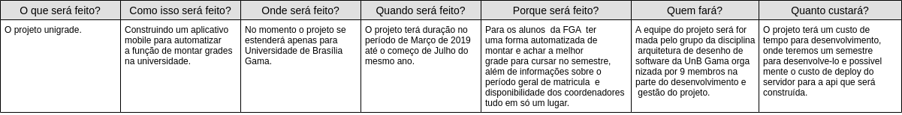

# Documento de Visão

## Histórico de revisões
|   Data   |  Versão  |        Descrição       |          Autor(es)          |
|:--------:|:--------:|:----------------------:|:---------------------------:|
|  17/06/2019 |  0.1 | Iniciação do documento  |  Joberth Rogers, Guilherme Aguiar, Gabriel Jesus|

## Sumário
[1. Introdução](#1-introducao)  
[2. Posicionamento](#2-posicionamento)  
[3. Visão geral do produto](#3-visao-geral-do-produto)  
[4. Interligação com outros sistemas](#4-interligacao-com-outros-sistemas)  
[5. Alternativa e concorrência](#5-alternativa-e-concorrencia)  
[6. Restrições](#6-restricoes)  
[7. Documentação](#7-documentacao)  

## 1. Introdução
 
Este documento visa o entendimento geral do projeto ao definir as necessidades para o desenvolvimento do aplicativo Unigrade, que tem como objetivo oferecer a alunos da UnB várias opções de grade horária a partir de alguns dados fornecidos pelo usuário.
As informações contidas neste documento são apresentadas com alto nível de abstração, de forma que o entendimento sobre o sistema seja claro para todos os envolvidos na produção. 
Além dos atributos necessários para a compreensão do software, também será descrito o sistema de forma contextual, destacando o seu posicionamento frente ao problema, os envolvidos e seu determinado escopo. Para tal, segue-se uma organização em tópicos informativos relacionados às necessidade do projeto.

### 1.1 Finalidade

 O presente documento tem como finalidade manter uma visão comum para os envolvidos no projeto do sistema de criação de grades horárias da UnB ao expor as ideias necessárias para seu desenvolvimento.

### 1.2 Escopo

Todos os semestres a Universidade de Brasília recebe muitos alunos, e com o passar do tempo da vida acadêmica, esses alunos entram em contato com o comportamento de seu curso, o fluxo de formação, e junto com isso vem a dúvida: o que cursar no semestre seguinte. A cada semestre todos os alunos têm o mesmo comportamento de verificar as possibilidades de matérias no fluxo do Matrícula Web e pedir essas matérias na pré matrícula, mas nem sempre sai como esperado, pois muitas das vezes esses alunos não conseguem as disciplinas requeridas e tem que recorrer a outras alternativas. Sabendo deste problema, o Unigrade, visa facilitar a de criação de grades, automatizando esse processo por meio do nosso aplicativo para celular.

### 1.3 Definições, Acrônimos e Abreviações

Abaixo serão apresentados algumas definições importantes para o entendimento do documento a seguir no contexto da universidade.

* **UnB :** Universidade De Brasília.
* **FGA :** Faculdade do Gama - Campus da Universidade de Brasília localizado no Gama.

### 1.4 Referências

* IBM Knowledge Center - Documento de Visão: A estrutura de tópicos do documento de visão. Disponível em: <https://www.ibm.com/support/knowledgecenter/en/SSWMEQ_4.0.6/com.ibm.rational.rrm.help.doc/topics/r_vision_doc.html>  Acesso em 6 de jun. de 2019;

### 1.5 Visão Geral

Esse é um documento sobre o aplicativo UniGrade, que está organizado no formato de tópicos e subtópicos sequenciais numerados. A ordem desses tópicos começa em 1 e termina em 7, sendo eles: introdução; posicionamento; descrições dos envolvidos e dos usuários; alternativa e concorrência; visão geral do produto; recursos do produto; restrições; faixas de qualidade; precedência e prioridade; outros requisitos do produto.

## 2. Posicionamento

### 2.1 Descrição do problema

#### 5W2H

| |Informações do Produto |
| ----| ------|
|O problema de | Falta de uma ferramenta que forneça amparo para os alunos criarem suas grades durante o período de matrícula da UnB |
|Afeta | Alunos da UnB |
| Cujo impacto é | Unificar tudo em um só lugar,  a criação de grades de acordo com as preferência de horário e disciplina do estudante da UnB. |
| Uma boa solução seria | A elaboração de um software que filtre os cursos, disciplinas, turmas da Universidade de Brasília e disponibilize isso para os alunos recomendando grades horárias para ajudá-lo no período de pré matrícula |

### 2.2 Descrição dos envolvidos

O mercado desse aplicativo compreende todo os alunos do curso de graduação presencial da Universidade de Brasília, com o objetivo de disponibilizar serviços de recomendação de grades horárias para alunos dessa universidade. 

| Nome |Representa |Papel |
| ----- | ----- | ------ |
| Aluno | Todos os alunos da Universidade de Brasília. | Escolher as preferência de curso, disciplinas e classes e requisitar recomendação de grades horárias. |

### 2.3 Ambiente do usuário
| | |
| ---- | --- |
| Descrição do ambiente |O aplicativo estará disponível na plataforma Google Play. Para que o usuário use o sistema será necessário que o mesmo tenha em mão um dispositivo android para poder baixar o aplicativo e poder usar. |
| Acessos simultâneos |Dependerá da configuração realizada nos servidores, mas a ideia é atender pelo menos os alunos do campus gama. |
| Número de usuários |A ser levantados. |
| Ciclo de tarefas | Com a solução proposta, a expectativa é que os acessos sejam simultâneos. | 

## 3. Visão geral do produto

### 3.1 - Perspectiva do produto

O produto, inicialmente tem como meta a recomendação de grades horária para os alunos da Universidade de Brasília, usando como entrada as turmas escolhidas pelo usuário. O Unigrade tem o propósito de automatizar o processo de criação e recomendação de grades horárias para os alunos, recomendando lhe as melhores para servir de guia no período de pré matrícula.
Esse aplicativo visa atender os alunos principalmente no começo do semestre,  apresentando as informações mais atualizadas do Matrícula web nesse período e reunindo tudo em apenas um lugar.

### 3.2 Funcionalidade do Produto

O produto de software possuirá as seguintes funcionalidades:

#### a. Fluxo do curso 

Ao escolher o curso e o campus, o aluno conseguirá visualizar o fluxo mais recente do curso usando como base o matrícula web.
 

#### b. pesquisa inteligente

Para escolher suas preferência de grade horária, o aluno poderá pesquisar por:  nome da disciplina, nome do professor que leciona a disciplina e pelo código da disciplina. Além disso o usuário selecionará a turma que pretende cursar e usará os mesmos níveis de prioridade contidos no matrícula web para a geração das grades.

#### c. Grades geradas

A cada turma selecionada o algoritmo de geração de grades será executado e retornará as 5 melhores grades para os alunos de acordo com as preferências de turmas desejadas. O aluno poderá verificar as grades pelo aplicativo ou salvá-las como imagem para enviar para outros colegas.

#### d. Escolha de turmas

Ao escolher uma disciplinas o aluno poderá visualizar todas as turmas referente a sua escolha, caso o aluno pretenda cursar em determinada turma, ele terá a opção de escolher uma prioridade para a turma escolhida (como no Matrícula web), selecionando ela como uma preferência. Após as escolhas, as grades horárias serão recomendadas com as disciplinas escolhidas.

### 3.3 Licenciamento e Instalação

Todo o software será desenvolvido usando a plataforma do github. Como é um programa desenvolvido para fins educativos optou-se por usar a licença MIT, onde qualquer pessoa terá a permissão de contribuir ou usar o software como base para outros projetos, desde de que o mesmo tenha autoria dos desenvolvedores atuais do projeto. 
Para instalação do software os usuários irão necessitar de um dispositivo android e está conectado a plataforma Google play, caso seja um desenvolvedor e queira contribuir para o projeto, nos repositórios do projeto serão encontrados documentos que servirão de guia para instalação e execução dos ambientes do Unigrade.

## 4. Interligação com outros sistemas 

O software não terá qualquer conexão com outros sistemas, o que não impede de ter tal relação no futuro, já que o software dispõe de alta coesão e baixo acoplamento entre seus módulos.

## 5. Alternativa e concorrência

No momento não existe nenhum software que gere grades horárias especificamente para a Universidade de Brasília.

## 6. Restrições

1. No processo de construção do aplicativo deve-se optar por ferramentas livres e de baixo custo ou gratuitas, que minimizem o custo final do projeto, já que o projeto tem a finalidade acadêmica.

2. O servidor da API tem uma limitação devido ao tempo disponibilizado pelo heroku na sua versão gratuita. O heroku restringe um tempo mínimo de 6 horas obrigatórias por dia para o servidor ficar adormecido, sendo disponibilizado apenas 18 horas dos serviços para a aplicação poder executar suas atividades.

3. O adormecimento constante do heroku caso o mesmo não esteja sendo usado é uma restrição muito delicada em nosso servidor. Quando um usuário necessita usar os serviços do Unigrade é percebido um pequeno delay na resposta da requisição, devido ao heroku estar ainda levantando os serviços da API.  
   
## 7. Documentação

### 7.1 Ajuda online

Como o aplicativo terá poucas telas e será bem simples de se usar,  será desenvolvido um pequeno FAQ para auxílio do usuário na hora do manuseio do app.

 

 
