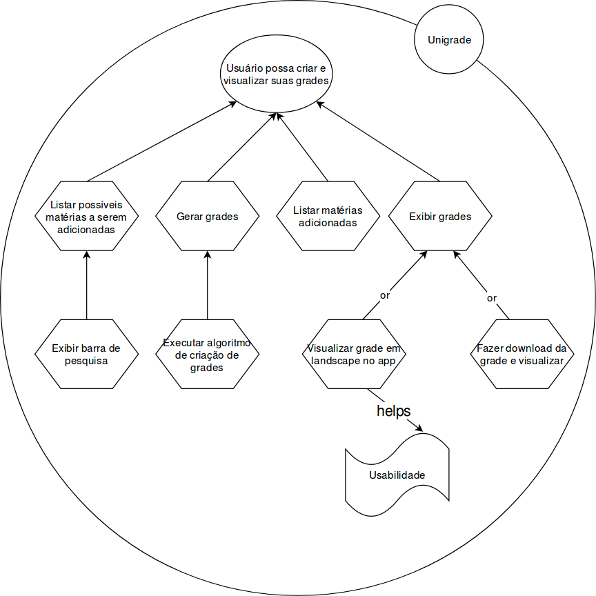

# iStar

## Histórico de revisões

|   Data   |  Versão  |        Descrição       |          Autor(es)          |
|:--------:|:--------:|:----------------------:|:---------------------------:|
|10/06/2019|    0.1   | Iniciando documento, Adicionando iStar, Strategic Dependence Model | Joberth Rogers |
|10/06/2019|    0.2   | Adicionando iStar 2 | Guilherme Aguiar |

## Sumário

[1. Strategic Dependency Models](#1-strategic-dependency-models)  
[2. Strategic Rationale Models](#2-strategic-rationale-models)  
[3. Referencias](#3-referencias)  

## 1. Strategic Dependency Models

### SD - Geral

Versão 1.0  

## 2. Strategic Rationale Models

### IS1 - Procurar novas opções de disciplinas

Versão 1.0  

### IS2 - Criar e visualizar grades

Versão 1.0  

## 3. Referências

* Slides Visão Complementar- IStar, Desenho e arquitetura de software, Prof. Milene Serrano.  
