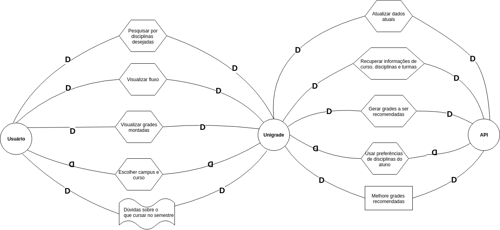
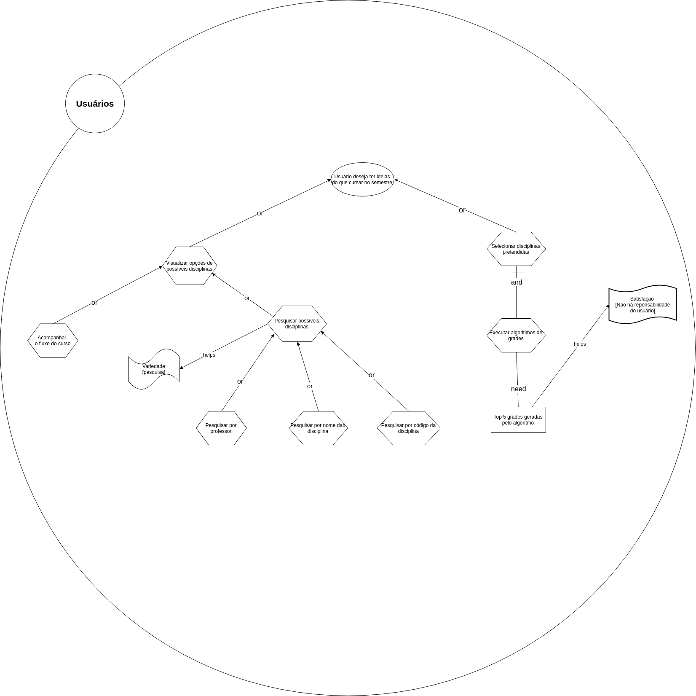

# Istars 

## Histórico de revisões
|   Data   |  Versão  |        Descrição       |          Autor(es)          |
|:--------:|:--------:|:----------------------:|:---------------------------:|
|10/06/2019|    0.1   | Iniciando documento, Adicionando Istar, Strategic Dependence Model | Joberth Rogers |

## Sumário
[1. Strategic Dependency Models](#strategic-dependency-models)  
[2. Strategic Rationale Models](#strategic-rationale-models)  
[3. Referencias](#referencias)  
## Strategic Dependency Models

### SD - Geral

## Strategic Rationale Models

### IS1 - Procurar novas opções de disciplinas

## Referências

* Slides Visão Complementar- IStar, Desenho e arquitetura de software, Prof. Milene Serrano.  
