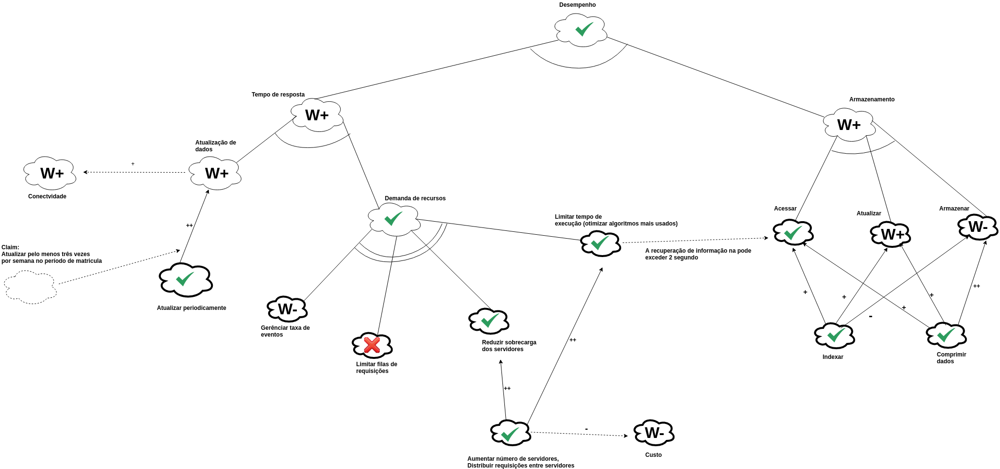

# Non-Functional Requirement  - NFR

## Histórico de revisões
|   Data   |  Versão  |        Descrição       |          Autor(es)          |
|:--------:|:--------:|:----------------------:|:---------------------------:|
|10/06/2019|    0.1   | Iniciando documento, Adicionando NFR Desempenho | Joberth Rogers |

## Sumário
[1. NFRs ](#nfrs)  
[2. Referências](#referencias)  

## Introdução

O NFR é um framework orientado a processos que procura evidenciar os requisitos não funcionais de um sistema, por meio de metas a serem atingidas. 

## NFRs

### NFR1 - Desempenho

## Referências

* Slides Visão Complementar- NFR, Desenho e arquitetura de software, Prof. Milene Serrano.  
