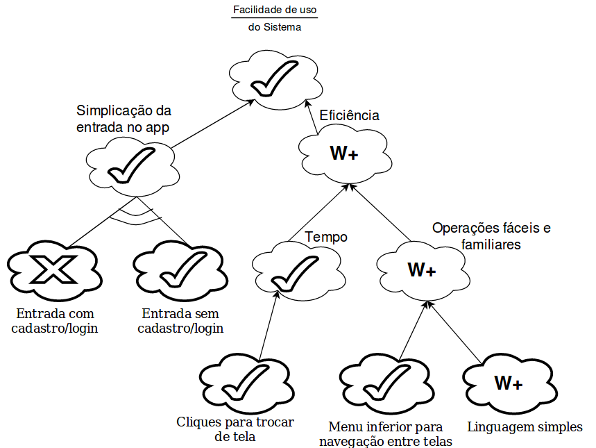
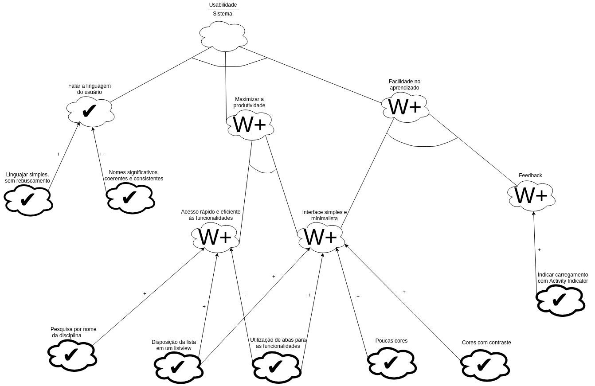

# Non-Functional Requirement  - NFR

## Histórico de revisões

|   Data   |  Versão  |        Descrição       |          Autor(es)          |
|:--------:|:--------:|:----------------------:|:---------------------------:|
|10/06/2019|    0.1   | Iniciando documento, Adicionando NFR Desempenho | Joberth Rogers |
|10/06/2019|    0.2   | Adicionando NFR Facilidade de Uso | Guilherme Aguiar |
|24/06/2019|    0.3   | Adicionando NFR Usabilidade | Daniel Maike |

## Sumário

[1. Introdução](#1-introducao)  
[2. NFRs](#2-nfrs)  
[3. Referências](#3-referencias)  

## 1. Introdução

 O NFR é um framework orientado a processos que procura evidenciar os requisitos não funcionais de um sistema, por meio de metas a serem atingidas. 

## 2. NFRs

### NFR1 - Desempenho

Versão 1.0  

### NFR2 - Facilidade de uso

Versão 1.0  

### NFR3 - Usabilidade

Versão 1.0  

## 3. Referências

* Slides Visão Complementar- NFR, Desenho e arquitetura de software, Prof. Milene Serrano.  
