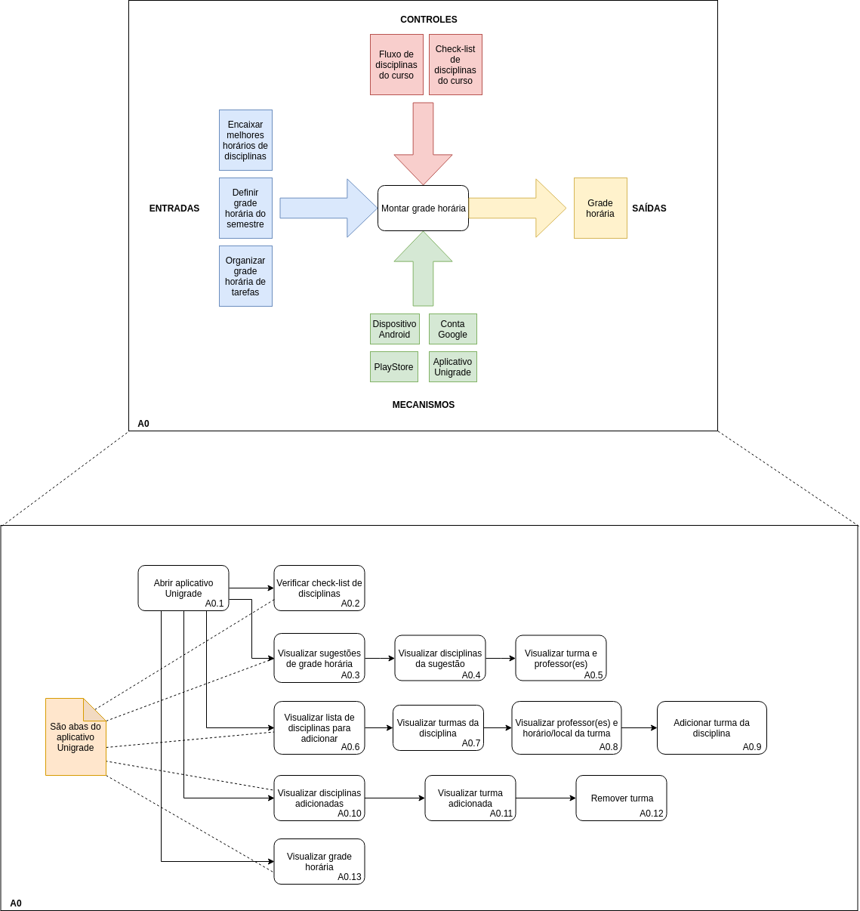

# Structure Analysis and Designg Technique - SADT

## Histórico de revisões

|   Data   |  Versão  |        Descrição       |          Autor(es)          |
|:--------:|:--------:|:----------------------:|:---------------------------:|
|10/06/2019|    0.1   | Inciando documento | Joberth Rogers |
|24/06/2019|    0.2   | Adição do Sumário, SADT e Referências | Daniel Maike |

## Sumário

[1. Introdução](#1-introducao)  
[2. SADT](#2-sadt)  
[3. Referências](#3-referencias)  

## 1. Introdução

O SADT (Structure Analysis and Designg Technique) é uma técnica de modelagem orientada ao desenho e à análise estruturada de software. A qual envolve as abstrações: Atividades e Subatividades, Entradas, Controles, Mecanismos e Saídas. 

## 2. Diagrama SADT

Versão 1.0  

## 3. Referências

* Slides da aula 08 da disciplina de Arquitetura e Desenho de Software da UnB-Gama - Professora: Milene Serrano  
